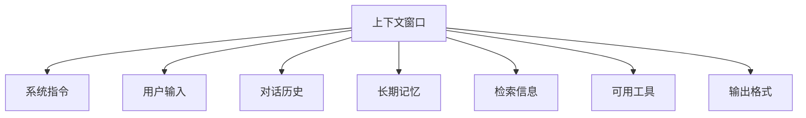

# AI 开发新范式：从提示词优化到上下文架构设计

在 AI 应用开发领域，我们正在经历一次重要的思维转变。过去几年，开发者们专注于打磨完美的提示词，但现在，真正决定 AI 系统成败的关键因素已经发生了根本性变化。

## 1. 传统提示词工程的局限性

让我们先回顾一下传统的提示词工程。大多数开发者的工作流程是这样的：

```
用户需求 → 设计提示词 → 调用模型 → 获得输出
```

这种方法在简单场景下效果不错，但当我们构建复杂的 AI 应用时，就会遇到瓶颈。传统提示词工程存在明显的静态性限制，提示词是预设的，无法根据实时情况动态调整。同时，它只能处理当前输入，缺乏历史记忆和外部数据整合能力，形成了信息孤岛。更重要的是，传统方法缺乏工具能力，无法主动获取所需信息或执行具体操作。

## 2. 上下文工程：系统化的信息管理

上下文工程解决的核心问题是：**如何为 AI 模型提供完整、准确、及时的决策依据**。

### 2.1 上下文的七个维度

现代 AI 系统的上下文包含以下关键组件：



系统指令层定义 AI 的基本行为模式和专业领域，这是整个上下文架构的基础。即时输入层处理用户的当前请求和任务描述，确保系统能准确理解用户意图。短期记忆层维护当前会话的上下文和状态信息，保持对话的连贯性。长期记忆层存储跨会话的用户偏好和历史交互数据，实现个性化服务。知识检索层负责实时获取外部信息和文档内容，扩展模型的知识边界。工具接口层提供可调用的 API 和功能模块定义，赋予 AI 执行能力。格式控制层规范输出结构和数据格式，确保结果的可用性。

### 2.2 实际案例：智能邮件助手的对比

让我们通过一个具体例子来理解两种方法的差异。

**场景**：处理邮件"嘿，想确认一下，你明天方便快速碰一下吗？"

**传统提示词方法**：
```
输入：邮件内容 + 简单指令
输出：机械化回复 - "感谢您的信息。明天我可以，请问你想几点碰面？"
```

**上下文工程方法**：
```python
# 系统会动态收集以下上下文信息
context = {
    "calendar_data": get_tomorrow_schedule(),  # 发现明天已满
    "email_history": get_conversation_with_sender(),  # 确定沟通风格
    "contact_info": identify_sender_importance(),  # 识别为重要合作伙伴
    "available_tools": ["send_invite", "check_availability"],
    "user_preferences": {"communication_style": "casual_professional"}
}

# 基于完整上下文生成回复
output = generate_response(context)
```

**输出**：
"嘿，Jim！明天我的日程已经排满了，一整天都是背靠背的会议。周四上午我有空，不知道你是否方便？我已经发了个邀请，看看是否合适。"

## 3. 上下文工程的技术实现

### 3.1 动态信息收集策略

上下文工程的核心是建立智能的信息收集机制。这个机制需要能够根据用户输入的内容和上下文状态，智能地判断需要收集哪些信息，并动态地组装这些信息形成完整的上下文。整个过程类似于一个智能的信息管家，它知道在什么时候需要什么样的信息，并能够高效地获取和组织这些信息。

```python
class ContextEngine:
    def __init__(self):
        self.memory_store = LongTermMemory()
        self.tool_registry = ToolRegistry()
        self.retrieval_system = RAGSystem()
    
    def build_context(self, user_input, session_id):
        context = {
            "system_prompt": self.get_system_prompt(),
            "user_input": user_input,
            "conversation_history": self.get_session_history(session_id),
            "user_memory": self.memory_store.get_user_context(session_id),
            "relevant_tools": self.tool_registry.get_available_tools(),
        }
        
        # 动态判断是否需要检索外部信息
        if self.needs_external_info(user_input):
            context["retrieved_info"] = self.retrieval_system.search(user_input)
        
        return self.optimize_context_window(context)
```

### 3.2 上下文窗口优化

由于模型的上下文长度限制，我们需要智能地管理信息优先级。这个过程需要考虑信息的重要性排序，通常核心任务信息的优先级最高，其次是用户偏好，最后是历史对话记录。同时，我们需要实施动态压缩策略，对历史对话进行总结，保留关键决策点而去除冗余信息。另外，分层加载机制也很重要，它能够根据任务复杂度逐步加载上下文信息，避免一次性加载过多不必要的信息。

## 4. 企业级应用的最佳实践

### 4.1 设计模块化的上下文架构

在企业级应用中，我们需要设计一个清晰的三层架构来支撑上下文工程。用户接口层负责输入验证和格式标准化，确保输入数据的质量和一致性，同时处理输出渲染，为用户提供友好的交互界面。上下文引擎作为中间层，承担信息收集、上下文组装和窗口优化的核心职责，它是整个系统的大脑。AI 模型层专注于推理生成、工具调用和结果验证，确保输出的准确性和可靠性。

```
┌─────────────────┐    ┌─────────────────┐    ┌─────────────────┐
│   用户接口层    │    │   上下文引擎    │    │   AI 模型层      │
├─────────────────┤    ├─────────────────┤    ├─────────────────┤
│ • 输入验证      │───▶│ • 信息收集      │───▶│ • 推理生成      │
│ • 格式标准化    │    │ • 上下文组装    │    │ • 工具调用      │
│ • 输出渲染      │◀───│ • 窗口优化      │◀───│ • 结果验证      │
└─────────────────┘    └─────────────────┘    └─────────────────┘
```

### 4.2 建立上下文质量监控

建立完善的上下文质量监控体系是确保系统稳定运行的关键。完整性检查确保关键信息不遗漏，这需要建立信息清单和验证机制。准确性验证关注检索信息的时效性和正确性，特别是对于实时数据和外部 API 返回的信息。性能监控则跟踪上下文构建的耗时和成本，帮助优化系统效率和控制运营成本。

### 4.3 实现渐进式上下文增强

根据任务复杂度动态调整上下文信息的丰富程度是一个重要的优化策略。对于简单任务，只需要基础的上下文信息就能很好地完成；中等复杂度的任务需要加入历史上下文来提供更好的决策依据；而复杂任务则需要完整的上下文信息，包括外部知识和多种工具支持。

```python
def progressive_context_enhancement(task_complexity):
    if task_complexity == "simple":
        return basic_context()
    elif task_complexity == "medium":
        return basic_context() + historical_context()
    else:
        return full_context() + external_knowledge()
```

## 5. 技术发展趋势与展望

### 5.1 多模态上下文整合

未来的上下文工程将整合更多数据类型，实现真正的多模态智能。图像和视频理解能力将使 AI 系统能够处理视觉信息，音频和语音信息的整合将支持更自然的交互方式，而传感器数据和实时状态的接入将使 AI 系统能够感知和响应物理世界的变化。这种多模态的整合将大大扩展 AI 应用的场景和能力边界。

### 5.2 自适应上下文管理

AI 系统将具备自主学习最优上下文配置的能力，这代表了上下文工程的未来发展方向。系统能够根据任务成功率自动调整信息权重，学习用户个性化的上下文偏好，并自动发现新的有效信息源。这种自适应能力将使 AI 系统变得更加智能和高效。

## 6. 实践建议

对于正在开发 AI 应用的团队，我们建议首先重新审视架构设计，从单一提示词转向系统化的上下文管理思维。这需要团队投资基础设施建设，包括记忆存储系统、检索系统和工具集成能力的构建。同时，建立科学的评估体系也很重要，需要制定上下文质量的量化指标来指导优化工作。最后，基于用户反馈和系统表现持续优化迭代是保持竞争力的关键。

## 7. 结语

上下文工程代表了 AI 应用开发的新阶段。它不仅仅是技术升级，更是思维方式的转变——从追求完美的提示词，转向构建智能的信息管理系统。

在这个新范式下，AI 应用的成功取决于我们为模型提供多么丰富、准确、及时的决策依据。掌握上下文工程，就掌握了构建真正实用 AI 系统的关键。

---

*本文基于对当前 AI 开发实践的深度分析，结合多位技术专家的经验总结而成。希望能为正在探索 AI 应用开发的技术团队提供有价值的参考。*