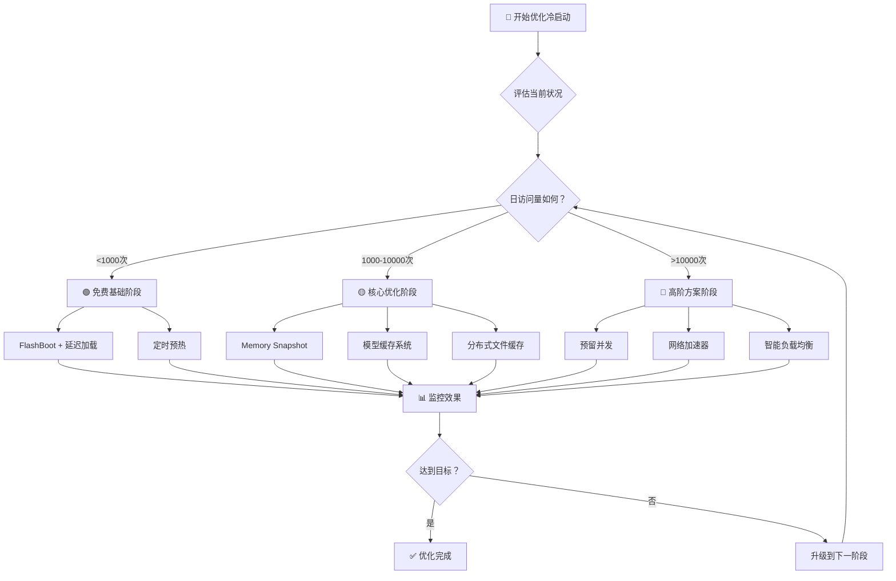

# 降低 Serverless 冷启动延迟的完整实践指南

## 开篇：冷启动问题的核心挑战

Serverless 应用开发者经常面临一个性能瓶颈：用户首次访问应用时响应时间显著延长，但后续访问速度正常。这种现象被称为"冷启动"，是 Serverless 架构的固有特性。

冷启动发生在 Serverless 平台需要从零开始创建新的执行环境时。当没有可用的运行容器时，系统必须执行一系列耗时操作：创建新容器、拉取应用镜像、加载运行时环境、初始化应用代码。对于 AI 模型推理应用，这个过程更加复杂，需要额外下载数 GB 的模型权重文件。例如，一个典型的 Stable Diffusion 模型完整冷启动可能耗时 2-3 分钟。

冷启动对业务的影响是实际且可量化的。每增加 1 秒的响应延迟，用户转化率平均下降 7%，直接影响营收表现。延迟还会增加运营负担，包括额外的监控成本和客户投诉处理。在竞争激烈的市场环境中，响应速度慢的应用很难获得用户青睐。

本文将系统介绍 8 种经过生产环境验证的冷启动优化策略，涵盖从零成本的基础优化到企业级的高级解决方案，帮助开发者构建高性能的 Serverless 应用。

## 1. 快速决策流程图

在深入具体技术方案之前，我们先通过一个简单的决策流程来帮你快速定位最适合的优化策略：



## 2. 免费基础阶段：零成本起步

### 2.1 FlashBoot 预测性缓存：最经济的起点

对于刚开始接触冷启动优化的开发者来说，FlashBoot 是一个理想的起点，因为它完全免费且无需任何配置。这项技术通过机器学习预测用户访问模式，提前准备容器，能够将冷启动时间从原来的 10-15 秒降低到 500ms-1 秒，95% 的请求都能在 2.3 秒内完成。FlashBoot 的工作原理是分析你的应用访问模式，当系统检测到某个端点可能即将收到请求时，会提前启动容器进行预热。

```bash
# 你可以通过查看日志来确认 FlashBoot 是否在工作
curl -X GET https://api.runpod.io/v2/logs | grep "FlashBoot"
# 看到这样的输出说明正在生效：Cold start accelerated by FlashBoot: 0.8s
```

需要注意的是，FlashBoot 的效果高度依赖于你的流量模式。如果你的应用有规律的访问模式，比如工作日的上午流量较高，或者用户习惯在特定时间段使用，那么 FlashBoot 的预测准确度会很高，效果显著。但如果是低频且随机的访问模式，效果就会比较有限。

### 2.2 延迟加载与智能缓存：专为 AI 应用设计

传统做法是在容器启动时就加载所有模型，这会拖慢启动速度。更聪明的做法是按需加载并缓存，这样既能减少初始容器启动时间，后续请求又能受益于缓存，还能避免为未使用的模型付费。

```python
class LazyModelLoader:
    def __init__(self):
        self._model = None
        self._cache_path = "/tmp/model_cache"
    
    def load_model(self):
        if self._model is None:
            if os.path.exists(self._cache_path):
                print("Loading from cache...")
                self._model = torch.load(self._cache_path)
            else:
                print("Downloading model...")
                self._model = download_and_load_model()
                torch.save(self._model, self._cache_path)
        return self._model
```

在设计缓存策略时，优先使用 SSD 存储，因为访问速度比网络下载快 10 倍；实现 LRU 缓存策略来自动清理不常用模型；如果可能的话，考虑跨容器共享缓存（如使用 Network Volume），这样能让整个应用集群受益于同一份缓存。

### 2.3 定时预热：用"心跳"保持应用活跃

定时预热是一个成本极低但效果不错的策略，基本思路是通过定期发送请求来防止容器被销毁。你可以使用 cron 作业每 5 分钟调用一次健康检查端点，或者在代码中实现一个简单的调度器。

```bash
# 使用 cron 作业定时调用
*/5 * * * * curl -X POST https://your-api.com/health-check
```

```python
import schedule
import time

def keep_warm():
    requests.get('https://your-endpoint.com/ping')

schedule.every(4).minutes.do(keep_warm)
```

关键是要把间隔时间设为容器超时时间的 80%，使用轻量级的健康检查端点而不是完整的推理请求，并且要避免在低流量时段过度 ping 浪费资源。每天大约会产生 300-400 次轻量级请求，成本通常低于 1 美元，对于大多数应用来说都是可以接受的。

## 3. 核心优化阶段：平衡性能与成本

### 3.1 Memory Snapshot：游戏级的"快速存档"

当基础优化无法满足你的性能需求时，Memory Snapshot 技术就成了一个很有吸引力的选择。这项技术就像游戏的存档功能，在容器完成预热后捕获完整内存状态，将内存快照保存到高速存储，当新容器启动时直接恢复内存状态，跳过所有初始化过程直接处理请求。

这种方式能带来显著的性能提升：传统冷启动需要 10-15 秒，使用快照后只需要 2-3 秒，性能提升达到 3-5 倍。实现起来也相对简单：

```python
@app.function(memory_snapshot=True)
def my_function():
    # 预热逻辑
    initialize_models()
    
    # 标记快照点
    create_memory_snapshot()
    
    # 后续请求将从这里恢复
    return handle_requests()
```

不过这项技术也有一些限制需要考虑：只能快照 CPU 内存，GPU 显存需要特殊处理；快照文件通常比较大，需要高速网络传输；代码复杂度会增加，需要处理快照失效的情况。但对于大多数 AI 应用来说，这些限制都是可以接受的，特别是考虑到显著的性能提升。

### 3.2 Baseten 模型缓存：工业级解决方案

如果你的应用已经有了一定的用户量，那么投资一个工业级的模型缓存系统就很有必要了。Baseten 提供了一套完整的模型缓存系统，通过后台 Rust 线程预取权重文件，实现真正的后台并行下载，不阻塞容器启动。

```yaml
# config.yaml
model_cache:
  - repo_id: stabilityai/stable-diffusion-xl-base-1.0
    revision: 462165984030d82259a11f4367a4eed129e94a7b
    use_volume: true
    volume_folder: sdxl-base
    allow_patterns:
      - "*.json"
      - "*.safetensors"
    ignore_patterns: 
      - "*.bin"  # 只缓存需要的格式
```

这个系统的核心优势在于精确控制，你可以通过 allow_patterns 只缓存真正需要的文件格式，减少存储空间；支持私有仓库和多种存储源，包括 Hugging Face、S3、GCS 等；最重要的是支持真正的后台下载，让你可以在模型下载期间做其他初始化工作。

```python
class Model:
    def load(self):
        # 可以在模型下载期间做其他初始化工作
        random_vector = torch.randn(1000)  # 5秒初始化
        
        # 这时候前5-10GB权重通常已经下载完成
        self._lazy_data_resolver.block_until_download_complete()
        
        # 现在可以安全地使用模型文件
        self.model = torch.load("/app/model_cache/sdxl-base/model.safetensors")
```

### 分布式文件系统缓存（B10Cache）

当你的应用规模进一步扩大，多个实例需要共享模型权重时，分布式文件系统缓存就显得非常重要了。B10Cache 是 Baseten 的分布式缓存系统，在区域级别缓存模型权重，多个 Pod 可以共享同一份缓存，热缓存的传输速度能达到 1GB/s 以上，还有 14 天自动垃圾回收机制来管理存储成本。

```bash
# 查看部署日志确认是否启用了 B10Cache
[INFO] b10cache is enabled.
[INFO] Symlink created successfully. Skipping download for model.safetensors
```

这个系统的缓存策略很智能：首次下载时以正常速度填充缓存，一旦缓存命中就能几乎瞬时完成；同一物理节点上的 Pod 还可以进行热缓存共享，进一步提升效率。对于有一定规模的应用来说，这种投资是非常值得的。

## 🔴 高阶方案阶段：追求极致性能

### 预留并发：最直接但最昂贵的解决方案

当你的应用已经有了稳定且可观的流量，用户体验要求极高时，预留并发就是最直接有效的解决方案。这就像在餐厅高峰期前提前准备好厨师，通过配置参数始终保持一定数量的"热"容器运行。

```yaml
# Modal 配置示例
@app.function(
    min_containers=3,      # 最少保持3个容器
    buffer_containers=2,   # 额外准备2个缓冲容器
    scaledown_window=300   # 容器闲置5分钟后才销毁
)
def my_inference_function():
    return process_request()
```

预留并发能完全消除冷启动，响应时间接近 0，还支持动态调整来应对流量高峰。但代价也很明显：成本会显著增加，因为需要为闲置资源付费，而且需要准确预估流量模式。这种方案适合高频访问的生产服务，特别是用户体验要求极高的场景，比如实时对话的 AI 应用或者高频交易系统。

### 网络加速器：并行下载技术的威力

对于模型权重较大的应用，网络传输往往是冷启动的瓶颈。现代模型下载系统使用并行化字节范围下载技术，能大幅提升传输速度。这种技术的核心思想是将大文件分成多个小块，同时下载多个块，然后在本地重新组装。

```python
import concurrent.futures
import requests

def download_chunk(url, start_byte, end_byte):
    headers = {'Range': f'bytes={start_byte}-{end_byte}'}
    response = requests.get(url, headers=headers)
    return response.content

def parallel_download(url, file_size, chunk_size=1024*1024*10):  # 10MB chunks
    chunks = []
    with concurrent.futures.ThreadPoolExecutor(max_workers=8) as executor:
        futures = []
        for start in range(0, file_size, chunk_size):
            end = min(start + chunk_size - 1, file_size - 1)
            future = executor.submit(download_chunk, url, start, end)
            futures.append(future)
        
        for future in concurrent.futures.as_completed(futures):
            chunks.append(future.result())
    
    return b''.join(chunks)
```

这种技术能将单线程下载的 50-100 MB/s 提升到并行下载的 300-500 MB/s，在高带宽环境下甚至可达 1GB/s 以上。对于动辄几十 GB 的大模型来说，这种提升是非常显著的。

## 5. 优化建议与总结

冷启动优化应该渐进式进行：低流量应用先使用 FlashBoot 和延迟加载等免费方案，中等流量应用投入模型缓存和 Memory Snapshot，高流量应用考虑预留并发等高成本方案。

建立监控体系跟踪冷启动频率、响应时间和成本等关键指标，根据实际需求调整策略。在投入高级方案前计算 ROI，确保投资回报率合理。记住一个核心原则：选择最适合当前业务阶段的优化策略，通过渐进式路径以最低成本获得最大性能提升。

---

**参考资料：**
- Modal 冷启动优化文档
- RunPod FlashBoot 技术博客
- Baseten 模型缓存指南
- AWS Lambda 冷启动最佳实践

**作者简介：** 资深云原生架构师，专注于 Serverless 和 AI 基础设施优化，曾帮助多家公司将应用冷启动时间降低 80% 以上。