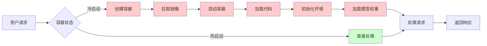
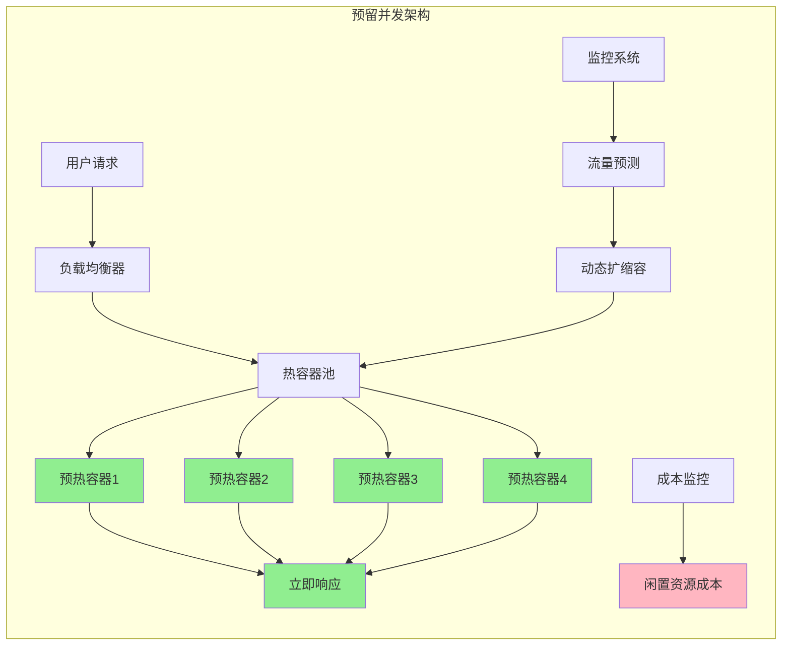
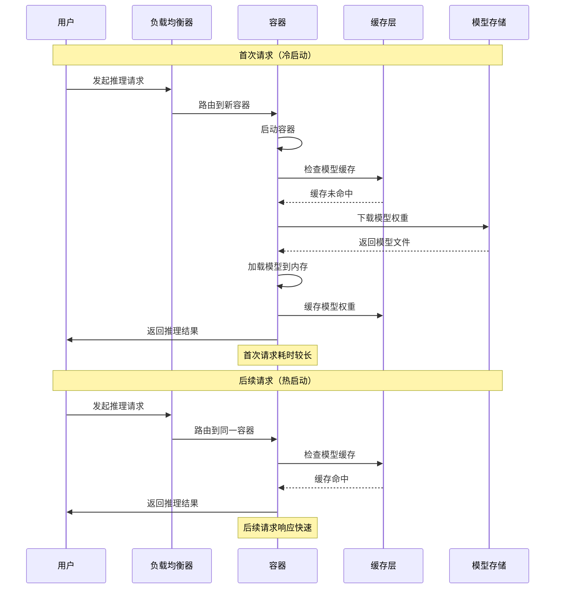
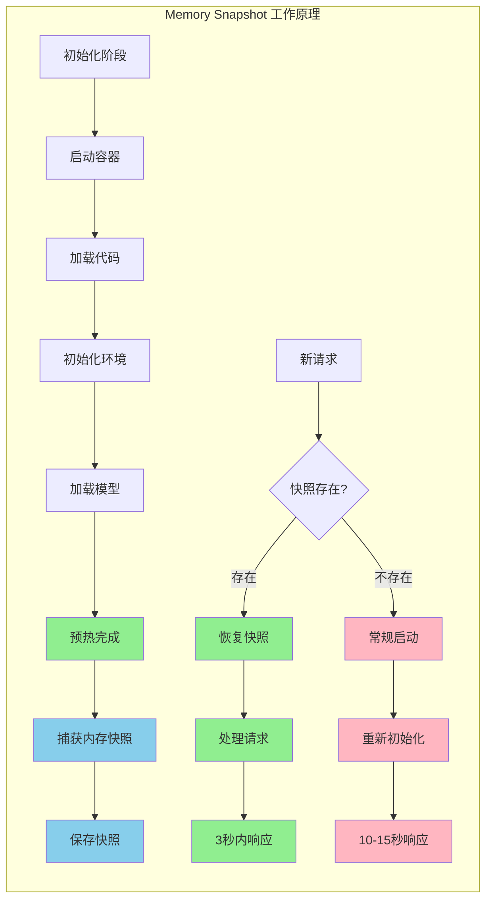
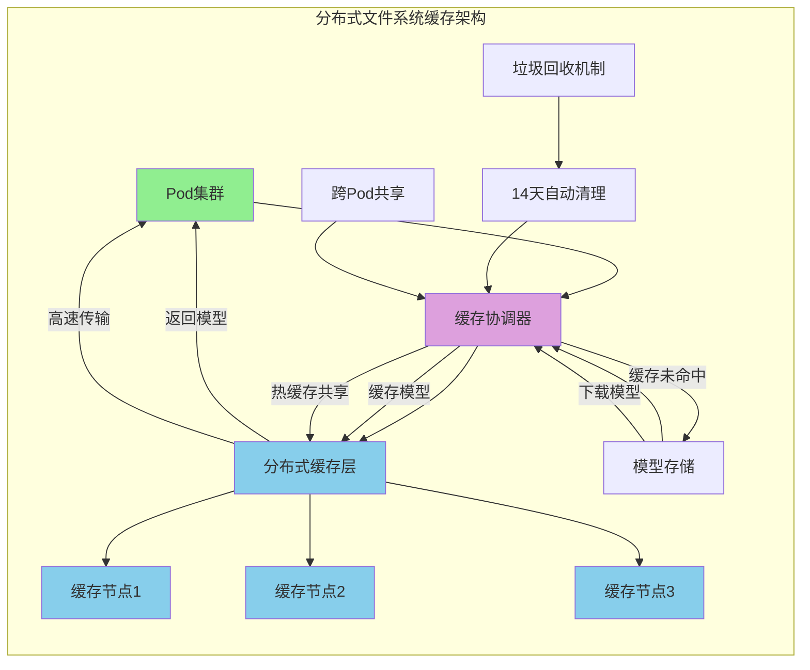
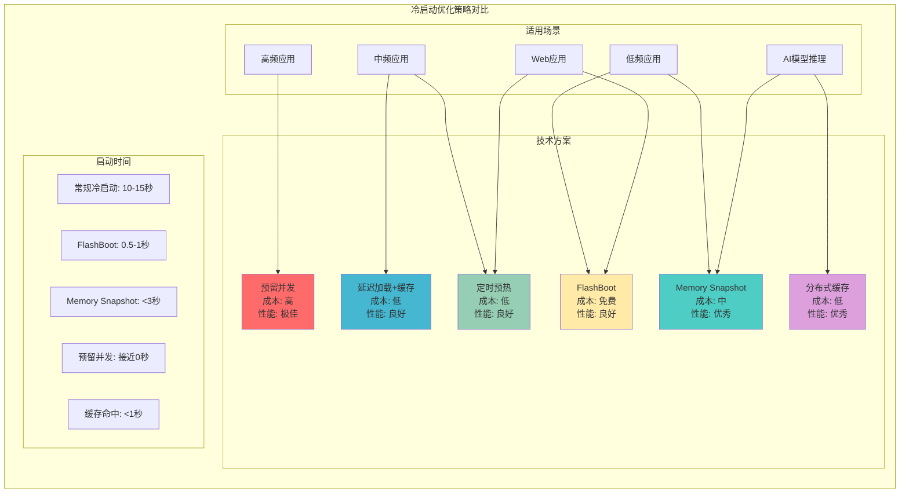

# 降低冷启动延迟的实用指南：让你的 Serverless 应用飞起来

## 1. 什么是冷启动？为什么它让人头疼？

如果你刚接触云计算和 Serverless，可能会遇到这样的问题：用户第一次访问你的应用时，响应特别慢，但后续访问就很快。这就是"冷启动"在作怪。

简单来说，冷启动就像是早上第一次启动汽车。引擎是凉的，需要时间预热才能正常工作。在 Serverless 环境中，当没有请求时，你的应用容器会被"冻结"或销毁来节省资源。当新请求到来时，系统需要重新启动容器、加载代码、初始化环境，这个过程就是冷启动。对于 AI 模型推理应用来说，冷启动更加明显，因为还需要额外的时间来加载几个 GB 的模型权重文件。

下面这个图清楚地展示了冷启动的完整过程：

可以看到，红色的部分都是冷启动过程中的耗时步骤，而绿色的部分是热启动（容器已存在）的快速路径。

## 2. 冷启动优化策略大盘点

### 2.1 使用预留并发/保持活跃

最直接的方法就是提前准备好"热"容器，就像餐厅在高峰期前提前准备好食材。你可以通过配置 `min_containers` 和 `buffer_containers` 参数，在闲置期间保持最少数量的容器处于"暖"状态，还可以通过 `scaledown_window` 延长容器空闲时间。这样做的好处很明显，完全消除预留实例的冷启动，提供一致的低延迟响应，还支持动态调整暖池大小应对高峰期。不过代价也很明显，成本会显著增加，因为需要为闲置资源付费，而且需要准确预估流量模式。

下面这个架构图展示了预留并发的工作原理：

这个架构的核心是维护一个热容器池，所有容器都已经预热完成，随时准备处理请求。

### 2.2 延迟加载模型和缓存

另一个聪明的做法是不要在启动时就加载所有东西，而是按需加载并缓存结果。具体来说，你可以仅在首次推理请求到达时才加载模型权重，一旦加载完成，就将其缓存在内存或本地存储（比如 SSD、Network Volume）。这样做能减少初始容器启动时间，后续请求会受益于缓存，还能避免为未使用的模型付费。当然，首次请求仍然会有模型加载延迟，而且需要精心设计应用架构和存储策略。

下面这个时序图展示了延迟加载和缓存的工作流程：

可以看到，这个策略的核心是将模型加载推迟到真正需要的时候，并通过缓存来加速后续请求。

### 2.3 通过定时任务或健康探测预热

还有一个简单有效的办法就是定期"叫醒"你的应用，让它保持活跃状态。你可以实施定时"ping"任务（比如 cron 作业），或者发送合成请求作为健康检查，定期调用推理端点以保持容器活跃。这样做能确保实例保持活跃和准备就绪，有效防止冷启动，实现成本相对较低。不过也有一些成本，会产生少量但持续的"ping"请求计算成本，可能需要智能调度避免浪费。

## 3. 前沿技术解决方案

### 3.1 Memory Snapshot 内存快照技术

现在有一些很酷的新技术来解决冷启动问题。Memory Snapshot 就像游戏的"快速存档"，直接恢复到预热完成的状态。具体做法是在容器预热完成后捕获内存状态，后续冷启动时直接恢复此快照，跳过大部分初始化过程。效果非常明显，能将冷启动时间从 10-15 秒显著降低至 3 秒以下，最多可实现 3 倍性能提升。不过这个技术也有限制，只能快照 CPU 内存，需要特殊处理 GPU 相关初始化，而且代码复杂度会增加。

下面这个流程图展示了 Memory Snapshot 的工作原理：

这个技术的核心是将预热完成的内存状态"冻结"保存，后续启动时直接"解冻"恢复，跳过耗时的初始化过程。

### 3.2 FlashBoot 优化层技术

FlashBoot 是另一个很有意思的技术，通过预测性缓存和优化的容器调度实现超快冷启动。这个技术的效果很厉害，冷启动时间低至 500ms-1 秒，95% 的冷启动在 2.3 秒内完成，而且无需额外费用。不过效果依赖于端点的使用频率和流量模式，对低频使用的端点效果有限。

### 3.3 分布式文件系统缓存

分布式文件系统缓存是一个很实用的技术，基本思路是在区域级别缓存模型权重，多个实例共享缓存。你可以启用分布式文件系统缓存，在区域级别缓存模型权重，支持跨部署共享缓存，14 天自动垃圾回收未使用文件。效果很明显，缓存命中时跳过下载，实现接近即时的权重加载，多个 Pod 间可热缓存共享，显著提升下载速度（>1GB/s）。不过目前处于 Beta 阶段，需要联系支持启用，而且初次缓存填充仍需从源下载。

下面这个架构图展示了分布式文件系统缓存的工作原理：

这个架构的关键是区域级的缓存层，所有 Pod 都可以共享同一份缓存，大大减少了重复下载的时间。

## 4. 如何选择合适的优化策略？

不同的优化策略有不同的特点和适用场景。下面这个对比图可以帮你快速选择最合适的策略：

### 4.1 根据应用类型选择

不同类型的应用需要不同的优化策略。如果你的应用是高频访问的，推荐使用预留并发/保持活跃，虽然成本较高，但用户体验最佳。中频访问的应用可以试试延迟加载模型和缓存加上定时预热，这样能平衡成本和性能。低频访问的应用推荐 Memory Snapshot 或 FlashBoot，接受首次访问稍慢，但后续访问快速。

### 4.2 根据预算选择

预算充足的话，使用预留并发获得最佳用户体验，结合分布式缓存进一步优化。预算有限的话，优先使用免费的 FlashBoot 技术，配合定时预热和延迟加载。

### 4.3 根据技术栈选择

AI 模型推理应用必须使用模型缓存和预取，结合内存快照技术。传统 Web 应用的话，定时预热加上延迟加载就够了，考虑使用 FlashBoot 优化。

## 5. 最佳实践建议

### 5.1 监控和测量

在优化之前，先建立监控系统，记录冷启动频率和延迟，监控成本变化，设置告警阈值。没有数据就没有优化的基础。

### 5.2 渐进式优化

不要一次性应用所有优化策略。先从免费的 FlashBoot 开始，根据监控数据决定是否需要更多优化，逐步引入成本较高的策略。这样能避免过度优化和不必要的成本支出。

### 5.3 预估成本

使用预留并发前，仔细计算成本。评估实际流量模式，计算预留资源的成本，与冷启动导致的用户流失成本对比。有时候冷启动的成本并不值得为了优化而付出高昂的预留成本。

### 5.4 定期优化

冷启动优化不是一次性工作。定期评估优化效果，根据业务增长调整策略，关注新技术发展。技术在不断进步，优化策略也要跟着调整。

## 6. 总结

冷启动优化是 Serverless 应用性能优化的重要环节。对于刚入门的开发者来说，建议从免费的优化技术开始，逐步深入。记住，最好的优化策略是适合你的应用场景和预算的策略。

随着技术发展，冷启动问题正在逐步得到解决。Memory Snapshot、FlashBoot 等新技术让冷启动时间从几十秒降低到几秒甚至几百毫秒。相信在不久的将来，冷启动将不再是 Serverless 应用的痛点。

---

**参考资料**：
- Modal 文档：https://modal.com/docs/guide/cold-start#cold-start-performance
- RunPod 博客：https://blog.runpod.io/introducing-flashboot-1-second-serverless-cold-start/
- Baseten 文档：https://docs.baseten.co/development/model/model-cache#optimizing-access-time-futher-with-b10cache-enabled 