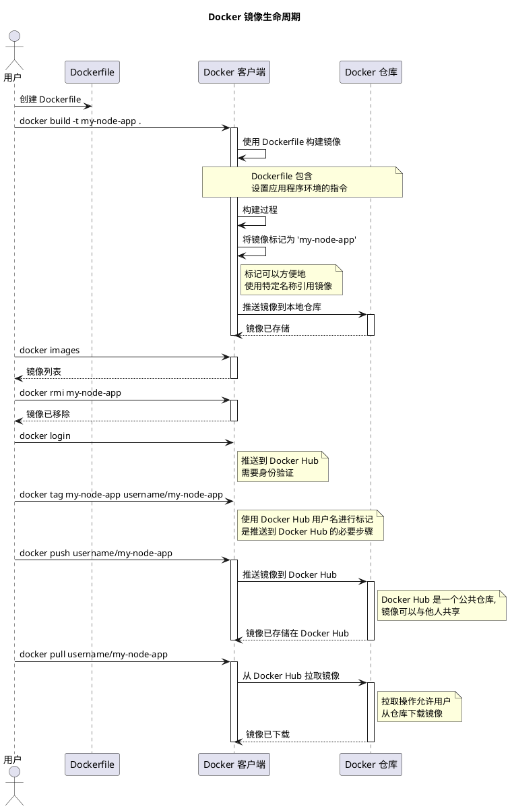

好的，朋友，你坐好，我跟你说个事儿。最近我真的被一个叫 Docker 的东西给迷住了，简直是开发者的福音，彻底改变了我对环境配置的看法。

你知道的，以前搞开发最头疼的是什么吗？就是那句“在我电脑上明明是好的啊！”。每次新加入一个项目，或者要把我的代码部署到服务器上，光是配环境就得折腾个半死。什么 Python 版本不对、缺个依赖库、系统变量没设置……有时候搞一整天，心态都崩了。

直到我遇到了 Docker，这玩意儿就像是给我的应用程序准备了一个“集装箱”。我只要把我应用需要的所有东西——代码、运行时、库、环境变量——全都打包到一起，做成一个所谓的“镜像（Image）”。这个过程就像是给我的应用拍了张快照，包含了它运行所需的一切。

这一切的魔法，都从一个叫 `Dockerfile` 的文件开始。它就像一张菜谱，我只要在里面写清楚我的应用需要什么环境，依赖什么库，代码要放在哪里。写好这个“菜谱”后，我就在终端里敲一行命令：`docker build -t my-node-app .`。你看，这个 `-t` 参数特别好用，相当于给这个即将诞生的“集装箱”起了个小名，比如“my-node-app”，好记又好用。然后，Docker 就会勤快地按照我的“菜谱”，把所有东西打包好，一个崭新的、独立的镜像就诞生了。整个过程，就像是拥有了一个可以随身携带、到处运行的完美环境。

我可以用 `docker images` 命令看看我本地有哪些“集装箱”，一目了然。如果哪个镜像我不用了，`docker rmi my-node-app` 一下，就干干净净地删掉了，特别清爽。

但这还不是最酷的。最酷的是分享！我做好的这个“集装箱”镜像，可以传到一个叫 Docker Hub 的公共仓库里，它就像是程序员的 GitHub，不过存的是这些“集装箱”。当然，上传之前得先 `docker login` 一下，证明这个“集装箱”是我的。然后，为了让别人能在仓库里找到它，我得给它打个正式的标签，比如 `docker tag my-node-app username/my-node-app`，这里的 `username` 就是我在 Docker Hub 上的用户名。最后，`docker push username/my-node-app`，一推，全世界的开发者就都能看到我的这个“集装箱”了。

这样一来，我的同事或者服务器想用我的应用时，再也不用痛苦地一步步配环境了。他们只需要运行 `docker pull username/my-node-app`，就能把我那个一模一样的“集装箱”原封不动地下载下来。从那一刻起，“在我电脑上明明是好的啊”这句话，就真的成了历史。这种感觉，实在是太爽了！

## Docker 镜像生命周期图

