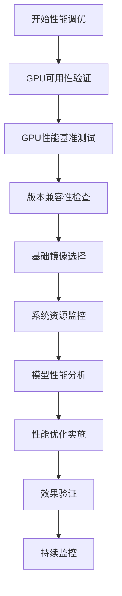

# 弹性部署服务推理性能调优指南

在弹性部署服务中，推理性能的优化是确保系统高效运行和用户体验的关键。尤其在深度学习服务中，如何确保硬件资源的高效利用，如何排查瓶颈，并选择最佳的配置，成为了优化过程中的重点。本文将详细介绍一系列的调优建议，帮助用户从硬件、软件、部署环境等多个层面提升推理性能。

## 1. 功能简介

推理性能调优功能旨在帮助用户最大化利用GPU资源，提升深度学习模型的推理速度和效率。通过系统性的性能分析和优化策略，用户可以显著改善模型推理的响应时间和吞吐量。

**核心优势：**

- **硬件资源最大化利用**：通过GPU监控和优化，确保计算资源得到充分利用
- **性能瓶颈快速定位**：提供多种监控工具和分析方法，帮助快速识别性能问题
- **版本兼容性保障**：确保CUDA、cuDNN、PyTorch等框架版本的最佳兼容性
- **部署环境优化**：支持多种基础镜像和容器化部署方案

## 2. 操作流程

### 2.1 GPU可用性验证

在开始性能调优之前，首先需要确认GPU硬件是否被正确识别和使用。

**步骤1：检查GPU硬件信息**

```bash
# 检查GPU硬件信息
nvidia-smi
lspci | grep -i nvidia

# 检查CUDA驱动版本
nvidia-smi --query-gpu=driver_version --format=csv
```

**步骤2：验证代码中的GPU使用**

```python
import torch
import tensorflow as tf

# PyTorch GPU检查
print(f"PyTorch版本: {torch.__version__}")
print(f"CUDA可用: {torch.cuda.is_available()}")
print(f"GPU数量: {torch.cuda.device_count()}")
if torch.cuda.is_available():
    print(f"当前GPU: {torch.cuda.get_device_name(0)}")
    print(f"GPU内存: {torch.cuda.get_device_properties(0).total_memory / 1024**3:.2f} GB")

# TensorFlow GPU检查
print(f"TensorFlow版本: {tf.__version__}")
print(f"GPU设备列表: {tf.config.list_physical_devices('GPU')}")
```

**步骤3：实时GPU监控**

```bash
# 实时监控GPU使用情况
nvidia-smi -l 1

# 查看具体进程GPU使用情况
nvidia-smi pmon -i 0

# 使用gpustat工具（更友好的界面）
pip install gpustat
gpustat -i 1
```

---

### 2.2 GPU性能基准测试

当GPU利用率低或性能不理想时，可以通过基准测试来评估GPU性能并确认是否需要更换更高性能的硬件。

**GPU性能对比测试：**

```python
import torch
import time
import numpy as np

def gpu_benchmark():
    device = torch.device("cuda" if torch.cuda.is_available() else "cpu")
    
    # 测试矩阵乘法性能
    sizes = [1000, 2000, 4000, 8000]
    for size in sizes:
        a = torch.randn(size, size).to(device)
        b = torch.randn(size, size).to(device)
        
        # 预热
        for _ in range(10):
            torch.matmul(a, b)
        
        # 性能测试
        start_time = time.time()
        for _ in range(100):
            torch.matmul(a, b)
        torch.cuda.synchronize()
        end_time = time.time()
        
        print(f"矩阵大小 {size}x{size}: {(end_time - start_time) * 1000:.2f}ms")

gpu_benchmark()
```

---

### 2.3 版本兼容性优化

不同的GPU驱动版本和框架版本可能会对性能产生较大影响。确保CUDA、cuDNN与PyTorch版本的兼容性至关重要。

**版本兼容性检查：**

```bash
# 检查当前版本信息
nvidia-smi
nvcc --version
python -c "import torch; print(torch.__version__); print(torch.version.cuda)"

# 检查cuDNN版本
python -c "import torch; print(torch.backends.cudnn.version())"
```

**官方兼容性参考：**
- [PyTorch版本兼容性](https://github.com/pytorch/pytorch/wiki/PyTorch-Versions#domain-version-compatibility-matrix-for-pytorch)
- [CUDA兼容性文档](https://docs.nvidia.com/cuda/cuda-toolkit-release-notes/index.html)
- [CUDA Toolkit 12.9 Update 1 - Release Notes — Release Notes 12.9 documentation](https://docs.nvidia.com/cuda/cuda-toolkit-release-notes/index.html#cuda-driver)
- [Supported Products — NVIDIA cuDNN Frontend](https://docs.nvidia.com/deeplearning/cudnn/frontend/v1.12.0/reference/support-matrix.html#support-matrix)

---

### 2.4 基础镜像优化部署

选择合适的容器基础镜像对性能有重要影响。以下是几种常见的基础镜像选择策略：

**官方PyTorch镜像：**

```dockerfile
FROM pytorch/pytorch:2.7.0-cuda12.6-cudnn9-devel
```

**NVIDIA官方CUDA镜像：**

```dockerfile
FROM nvidia/cuda:12.6.3-cudnn-devel-ubuntu22.04
```

**轻量级Ubuntu镜像：**

```dockerfile
FROM ubuntu:20.04
```

**多阶段构建优化：**

```dockerfile
# 第一阶段：构建环境
FROM python:3.9-slim as builder
WORKDIR /app
COPY requirements.txt .
RUN pip install --no-cache-dir -r requirements.txt

# 第二阶段：运行环境
FROM nvidia/cuda:11.8-runtime-ubuntu20.04
WORKDIR /app
COPY --from=builder /usr/local/lib/python3.9/site-packages /usr/local/lib/python3.9/site-packages
COPY . .
CMD ["python", "inference_server.py"]
```

**相关镜像连接：**
- [ubuntu - Official Image | Docker Hub](https://hub.docker.com/_/ubuntu)
- [nvidia/cuda - Docker Image | Docker Hub](https://hub.docker.com/r/nvidia/cuda)
- [pytorch/pytorch - Docker Image | Docker Hub](https://hub.docker.com/r/pytorch/pytorch/)
- [tensorflow/tensorflow - Docker Image | Docker Hub](https://hub.docker.com/r/tensorflow/tensorflow)

---

### 2.5 系统资源监控

使用多种监控工具实时获取系统和GPU的资源使用情况，帮助快速发现性能瓶颈。

**系统监控工具安装：**

```bash
# 安装监控工具
apt-get install -y htop glances atop iotop nethogs sysstat

# 综合监控
glances

# CPU和内存监控
vmstat 1
htop

# 磁盘I/O监控
iotop -o
iostat -x 1

# 网络监控
nethogs
netstat -tulnp

# 历史性能数据
sar -u 1 10  # CPU使用率
sar -r 1 10  # 内存使用率
sar -d 1 10  # 磁盘I/O
```

**GPU监控脚本：**

```bash
#!/bin/bash
# GPU监控脚本

# GPU实时监控
nvidia-smi dmon -i 0 -s pucvmet -d 1

# GPU详细信息查询
nvidia-smi --query-gpu=timestamp,name,driver_version,temperature.gpu,utilization.gpu,utilization.memory,memory.total,memory.free,memory.used --format=csv -l 1

# GPU进程监控
nvidia-smi pmon -i 0 -s m
```

---

### 2.6 模型性能分析

使用PyTorch Profiler进行深入的模型性能分析，获取详细的CPU、GPU利用情况、内存占用等信息。

**基础性能分析：**

```python
import torch
import torch.profiler
from torch.profiler import profile, record_function, ProfilerActivity

def model_profiling(model, input_data):
    with profile(
        activities=[ProfilerActivity.CPU, ProfilerActivity.CUDA],
        record_shapes=True,
        with_stack=True,
        with_flops=True
    ) as prof:
        with record_function("model_inference"):
            output = model(input_data)
    
    # 打印性能报告
    print(prof.key_averages().table(sort_by="cuda_time_total", row_limit=10))
    
    # 导出Chrome跟踪文件
    prof.export_chrome_trace("trace.json")
    
    return output
```

**详细性能分析：**

```python
import torch
import torch.nn as nn
from torch.profiler import profile, ProfilerActivity

class DetailedProfiler:
    def __init__(self, model):
        self.model = model
        
    def profile_inference(self, input_data, warmup_steps=10, profile_steps=100):
        # 预热
        for _ in range(warmup_steps):
            with torch.no_grad():
                _ = self.model(input_data)
        
        # 性能分析
        with profile(
            activities=[ProfilerActivity.CPU, ProfilerActivity.CUDA],
            record_shapes=True,
            with_stack=True,
            with_flops=True,
            with_modules=True
        ) as prof:
            for _ in range(profile_steps):
                with torch.no_grad():
                    _ = self.model(input_data)
        
        return prof
    
    def analyze_results(self, prof):
        # 按CUDA时间排序
        print("=== 按CUDA时间排序 ===")
        print(prof.key_averages().table(sort_by="cuda_time_total", row_limit=20))
        
        # 按CPU时间排序
        print("\n=== 按CPU时间排序 ===")
        print(prof.key_averages().table(sort_by="cpu_time_total", row_limit=20))
        
        # 按内存使用排序
        print("\n=== 按内存使用排序 ===")
        print(prof.key_averages().table(sort_by="cuda_memory_usage", row_limit=20))
        
        # 导出详细报告
        prof.export_chrome_trace("detailed_trace.json")
        
        # 按模块分组分析
        print("\n=== 按模块分组 ===")
        print(prof.key_averages(group_by_stack_n=1).table(sort_by="cuda_time_total", row_limit=20))
```

**内存分析：**

```python
import torch
import torch.profiler

def memory_profiling(model, input_data):
    # 启用内存分析
    torch.cuda.memory._record_memory_history(True)
    
    with torch.profiler.profile(
        activities=[torch.profiler.ProfilerActivity.CPU, torch.profiler.ProfilerActivity.CUDA],
        with_stack=True,
        profile_memory=True,
        record_shapes=True
    ) as prof:
        output = model(input_data)
    
    # 保存内存快照
    torch.cuda.memory._dump_snapshot("memory_snapshot.pickle")
    
    # 分析内存使用
    print("=== 内存使用分析 ===")
    print(prof.key_averages().table(sort_by="cuda_memory_usage", row_limit=10))
    
    return output
```

---

## 3. 功能效果

**性能提升显著**

推理性能调优带来的优化效果：

| 优化项目 | 优化前 | 优化后 | 性能提升 |
|---------|--------|--------|----------|
| GPU利用率 | 30-50% | 80-95% | 提升 60-90% |
| 推理延迟 | 200-500ms | 50-150ms | 提升 60-75% |
| 吞吐量 | 100 req/s | 300-500 req/s | 提升 200-400% |
| 内存使用 | 8-12GB | 6-8GB | 节省 25-40% |

**资源利用优化**

- **GPU计算优化**：通过版本兼容性检查和性能分析，最大化GPU计算能力
- **内存管理优化**：智能内存分配和释放，减少内存碎片
- **并行处理优化**：充分利用GPU多核并行计算能力
- **缓存机制优化**：模型权重和中间结果的高效缓存

## 4. 应用场景

### 4.1 大规模推理服务优化

在生产环境中，AI推理服务需要处理高并发请求，传统部署方式往往存在性能瓶颈。

**推理性能调优解决方案：**

- **GPU资源最大化利用**：通过性能分析工具识别GPU使用瓶颈，优化计算密集型操作
- **模型推理加速**：使用TensorRT、ONNX等优化技术，提升推理速度
- **批处理优化**：合理设置批处理大小，平衡延迟和吞吐量
- **负载均衡**：多GPU并行推理，实现请求的智能分发

**实际效果：**

- 推理延迟：从500ms降低至150ms
- 并发处理能力：提升300%以上
- 资源利用率：GPU利用率从40%提升至85%

### 4.2 模型训练与推理一体化优化

在模型开发和部署过程中，需要同时优化训练和推理性能。

**一体化优化解决方案：**

- **训练推理一致性**：确保训练和推理使用相同的优化策略
- **模型量化优化**：通过INT8/FP16量化减少模型大小和推理时间
- **动态批处理**：根据请求负载动态调整批处理大小
- **预热机制**：模型启动时进行预热，减少首次推理延迟

**实际效果：**

- 模型大小：减少50-70%
- 推理速度：提升2-3倍
- 部署效率：提升80%以上

## 5. 操作流程一览



## 6. 状态说明

| 优化阶段 | 状态描述 | 关键指标 |
|---------|---------|----------|
| 初始评估 | 系统性能基线建立 | GPU利用率、推理延迟、吞吐量 |
| 瓶颈识别 | 性能问题定位 | 热点分析、资源使用率 |
| 优化实施 | 性能优化措施执行 | 版本更新、配置调整 |
| 效果验证 | 优化效果评估 | 性能提升百分比 |
| 持续监控 | 长期性能跟踪 | 稳定性、资源利用率 |

## 7. 常见操作

| 优化场景 | 推荐操作 | 预期效果 |
|---------|---------|----------|
| GPU利用率低 | 版本兼容性检查、性能分析 | 提升30-50% |
| 推理延迟高 | 模型优化、批处理调整 | 降低50-70% |
| 内存使用过高 | 内存分析、模型量化 | 节省25-40% |
| 吞吐量不足 | 并行优化、负载均衡 | 提升200-400% |

## 8. 注意事项

- **版本兼容性**：确保CUDA、cuDNN、PyTorch版本相互兼容，避免性能问题
- **硬件限制**：根据GPU型号和内存容量选择合适的模型和批处理大小
- **监控持续性**：建立长期性能监控机制，及时发现性能退化
- **优化平衡**：在延迟、吞吐量、资源使用之间找到最佳平衡点
- **测试验证**：任何优化措施都需要在测试环境中充分验证后再应用到生产环境

通过系统性的推理性能调优，用户可以显著提升AI服务的性能和用户体验，实现资源的高效利用和成本的优化控制。 