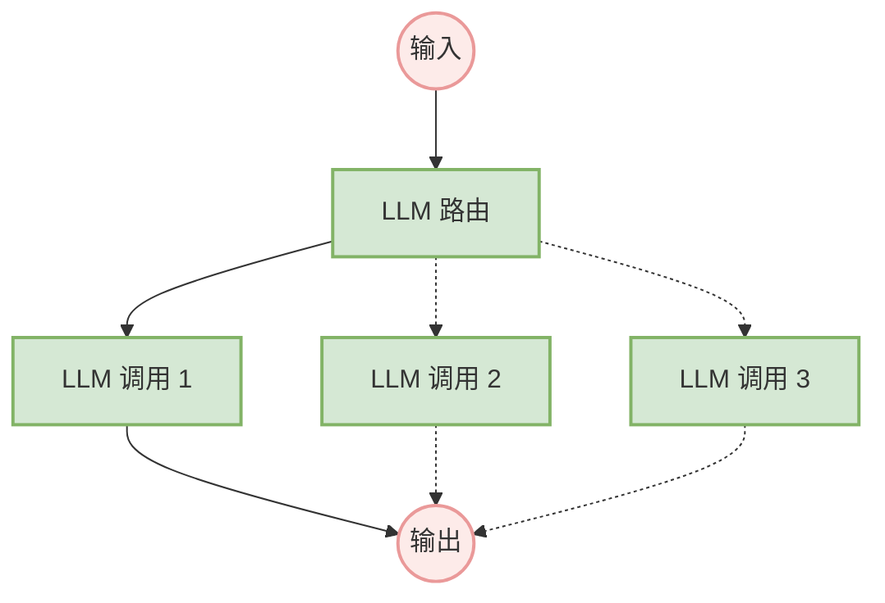

**何时使用**：当任务可以被轻松、清晰地分解为固定的子任务时，这个工作流非常理想。其主要目标是通过让每次LLM调用都成为一个更简单的任务，来换取更高的准确性。

**示例**：
-   生成营销文案，然后将其翻译成另一种语言。
-   撰写文档大纲，检查大纲是否符合特定标准，然后根据大纲撰写文档。

### 工作流：路由（Routing）

路由对输入进行分类，并将其引导至一个专门的后续任务。这个工作流允许关注点分离，并构建更专业的提示。否则，为一种输入进行的优化可能会损害在其他输入上的性能。

**何时使用**：当一个复杂任务有明显不同的类别，且这些类别分开处理效果更好，并且分类可以被LLM或传统分类模型准确处理时，路由模式非常有效。

**示例**： 