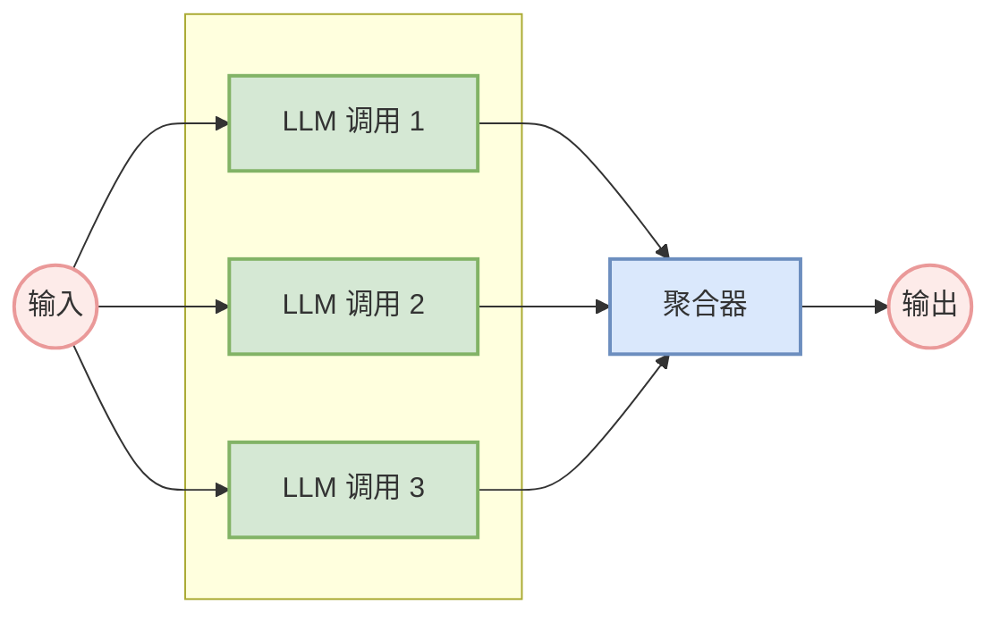
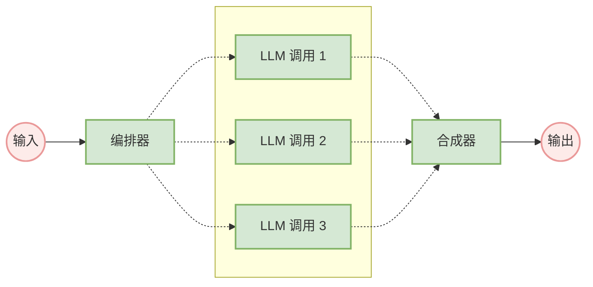
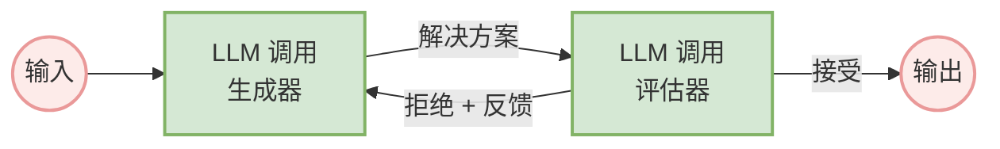
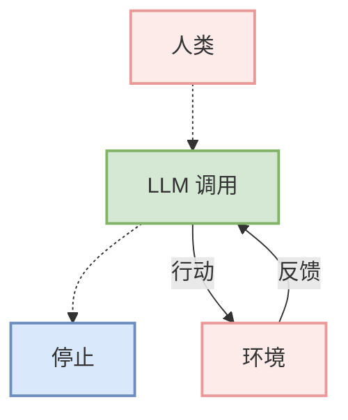
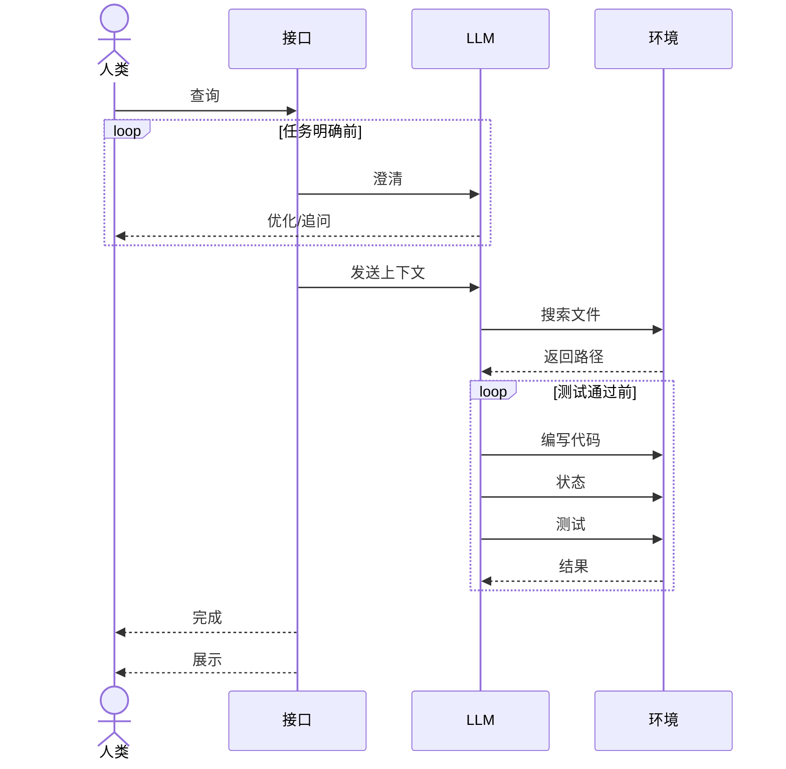

# 构建高效AI智能体：来自一线的实战模式解析

在过去一年里，我们与数十个来自不同行业的团队合作，共同构建大型语言模型（LLM）智能体。我们发现一个普遍现象：最成功的项目，往往不是依赖于复杂的框架或专门的库，而是采用简单、可组合的设计模式。

这篇文章将分享我们从服务客户和自研智能体过程中总结的经验，为开发者提供构建高效智能体的实用建议。

## 1.什么是智能体？

"智能体"可以有多种定义。有些客户将其定义为能够长时间独立运行、使用各种工具完成复杂任务的完全自主系统。另一些客户则用这个词来描述遵循预定义工作流程、更具规范性的实现。在Anthropic，我们将这些变体都归类为智能体系统，但在架构上对 工作流 和 智能体做重要区分：

-   工作流：在这类系统中，LLM和工具通过预定义的代码路径被编排执行。
-   智能体：在这类系统中，LLM动态地指导自身流程和工具的使用，并始终保持对任务完成方式的控制权。

下文中，我们将详细探讨这两种智能体系统。在附录1（"实践中的智能体"）中，我们描述了客户在使用这类系统中发现特别有价值的两个领域。

## 2.何时（以及何时不该）使用智能体
在用LLM构建应用时，我们建议先寻找最简单的解决方案，仅在必要时再增加复杂性。这甚至可能意味着根本不构建智能体系统。智能体系统通常以延迟和成本为代价，换取更好的任务性能，你需要仔细权衡这种交换是否值得。

当确实需要更高的复杂性时：对于定义明确的任务，工作流能提供更好的可预测性和一致性。

当需要大规模的灵活性和模型驱动决策时，智能体是更好的选择。

然而，对许多应用来说，通过检索和上下文示例来优化单次LLM调用通常就足够了。

## 3.如何以及何时使用框架

市面上有很多框架可以简化智能体系统的实现，例如：

-   LangChain的LangGraph；
-   Amazon Bedrock的AI Agent框架；
-   Dify，一个开源的LLM应用开发平台，可用于快速构建AI应用；
-   Coze（扣子），一个用于开发和调试AI聊天机器人的应用编辑平台。

这些框架通过简化调用 LLM、定义和解析工具、将调用链接在一起等标准的底层任务，让你能轻松上手。但是，它们也常常制造出额外的抽象层，可能会掩盖底层的提示和响应，使调试变得更加困难。它们还可能诱使你在一个更简单的设置就足够的情况下，不必要地增加复杂性。

我们建议开发者从直接使用LLM API开始：许多模式只需几行代码即可实现。如果你确实要使用框架，请确保你理解其底层代码。对底层机制的错误假设是导致出错的常见原因。

## 4.构建块、工作流与智能体

在本节中，我们将探讨在生产环境中观察到的常见智能体系统模式。我们将从最基础的构建块——增强型LLM——开始，逐步增加复杂性，从简单的组合式工作流到自主智能体。

### 4.1 构建块：增强型LLM

智能体系统的基础构建块是一个通过检索、工具和记忆等能力得到强化的LLM。我们目前的模型能够主动运用这些能力——生成自己的搜索查询、选择合适的工具，以及决定保留哪些信息。

我们建议在实现中关注两个关键方面：根据你的具体用例定制这些能力，并确保它们为你的LLM提供一个简单、文档完善的接口。

### 4.2 工作流：提示链（Prompt Chaining）

提示链将一个任务分解为一系列步骤，其中每个LLM调用处理前一个调用的输出。你可以在任何中间步骤添加程序化检查（如下图中的"关卡"），以确保流程仍在正轨上。

graph LR;
    A(("输入"));
    B["LLM 调用 1"];
    D["关卡"];
    E["LLM 调用 2"];
    G["LLM 调用 3"];
    H(("输出"));
    I(("退出"));

    A --> B;
    B -- "输出 1" --> D;
    D -- "通过" --> E;
    D -. "失败" .-> I;
    E -- "输出 2" --> G;
    G --> H;

    classDef red fill:#fdebe9,stroke:#ea9999,stroke-width:2px;
    classDef green fill:#d5e8d4,stroke:#82b366,stroke-width:2px;
    classDef blue fill:#dae8fc,stroke:#6c8ebf,stroke-width:2px;

    class A,H,I red;
    class B,E,G green;
    class D blue;

**何时使用**：当任务可以被轻松、清晰地分解为固定的子任务时，这个工作流非常理想。其主要目标是通过让每次LLM调用都成为一个更简单的任务，来换取更高的准确性。

**示例**：
-   生成营销文案，然后将其翻译成另一种语言。
-   撰写文档大纲，检查大纲是否符合特定标准，然后根据大纲撰写文档。

### 工作流：路由（Routing）

路由对输入进行分类，并将其引导至一个专门的后续任务。这个工作流允许关注点分离，并构建更专业的提示。否则，为一种输入进行的优化可能会损害在其他输入上的性能。

**何时使用**：当一个复杂任务有明显不同的类别，且这些类别分开处理效果更好，并且分类可以被LLM或传统分类模型准确处理时，路由模式非常有效。

**示例**：
-   将不同类型的客户服务查询（一般问题、退款请求、技术支持）引导至不同的下游流程、提示和工具。
-   将简单/常见问题路由到像Claude 3.5 Haiku这样更小的模型，将困难/不寻常的问题路由到像Claude 3.5 Sonnet这样更强大的模型，以优化成本和速度。

### 工作流：并行化（Parallelization）

LLM有时可以同时处理一个任务的不同部分，然后通过程序将它们的输出聚合起来。这种并行化工作流主要有两种形式：

-   **分片（Sectioning）**：将任务分解为并行运行的独立子任务。
-   **投票（Voting）**：多次运行同一个任务以获得多样化的输出。

**何时使用**：当分割的子任务可以并行化以提高速度，或者当需要多个视角或尝试以获得更高置信度的结果时，并行化是有效的。对于具有多个考量的复杂任务，如果每个考量都由一个单独的LLM调用来处理，LLM通常表现得更好。

**示例**：
-   **分片**：实现安全护栏，一个模型实例处理用户查询，而另一个实例则筛选不当内容或请求。这通常比让同一个LLM调用同时处理护栏和核心响应效果更好。
-   **投票**：审查一段代码是否存在漏洞，可以由几个不同的提示来审查，如果发现问题就标记出来。

### 工作流：编排器-工作者（Orchestrator-Workers）

在编排器-工作者工作流中，一个中心的"编排器"LLM动态地分解任务，将其委托给"工作者"LLM，并综合它们的结果。

**何时使用**：此工作流非常适合那些你无法预测所需子任务的复杂任务（例如，在编码中，需要更改的文件数量以及每个文件中更改的性质很可能取决于具体任务）。与并行化的关键区别在于其**灵活性**——子任务不是预定义的，而是由编排器根据具体输入决定的。

**示例**：
-   需要一次性对多个文件进行复杂更改的编码产品。
-   涉及从多个来源收集和分析信息以寻找可能相关信息的搜索任务。

### 工作流：评估器-优化器（Evaluator-Optimizer）

在评估器-优化器工作流中，一个LLM调用生成响应，而另一个在循环中提供评估和反馈。

**何时使用**：当存在清晰的评估标准，并且迭代改进能提供可衡量价值时，此工作流特别有效。一个好的应用场景通常有两个迹象：首先，当人类阐明他们的反馈时，LLM的响应可以得到明显改善；其次，LLM本身也能够提供此类反馈。

**示例**：
-   文学翻译，翻译者LLM最初可能无法捕捉到细微差别，但评估者LLM可以提供有用的批评。
-   需要多轮搜索和分析以收集全面信息的复杂搜索任务，由评估者决定是否需要进一步搜索。

## 智能体

随着LLM在理解复杂输入、进行推理和规划、可靠地使用工具以及从错误中恢复等关键能力上的成熟，智能体正在生产环境中崭露头角。

智能体的工作始于人类用户的命令或互动式讨论。任务明确后，智能体便独立进行规划和操作，并可能返回向人类寻求更多信息或判断。在执行过程中，至关重要的是，智能体在每一步都要从环境中获得"地面实况"（如工具调用结果或代码执行结果）来评估其进展。

智能体的实现通常很简单：**它们通常只是一个在循环中根据环境反馈使用工具的LLM**。因此，清晰而周到地设计工具集及其文档至关重要。

**何时使用智能体**：智能体可用于开放式问题，这些问题的步骤数量难以或不可能预测，也无法硬编码固定路径。LLM可能会运行多轮，你必须对其决策有一定程度的信任。智能体的自主性使其成为在受信任环境中扩展任务的理想选择。

智能体的自主性意味着更高的成本和潜在的复合错误。我们建议在沙盒环境中进行广泛测试，并配备适当的护栏。

**示例**：
-   一个用于解决SWE-bench任务的编码智能体，该任务涉及根据任务描述对多个文件进行编辑。
-   我们的"计算机使用"参考实现，其中Claude使用计算机来完成任务。

## 组合与定制这些模式

这些构建块并非一成不变的处方。它们是开发者可以根据不同用例进行塑造和组合的常见模式。成功的关键在于**衡量性能并迭代实现**。再次强调：只有在能明确改善结果时，才应考虑增加复杂性。

## 总结

在LLM领域取得成功，关键不在于构建最复杂的系统，而在于**为你的需求构建正确的系统**。从简单的提示开始，通过全面的评估来优化它们，只有在更简单的解决方案力不从心时，才添加多步智能体系统。

在实施智能体时，我们努力遵循三个核心原则：

1.  **保持智能体设计的简洁性。**
2.  **通过明确展示智能体的规划步骤来优先考虑透明度。**
3.  **通过详尽的工具文档和测试，精心打造你的智能体-计算机接口（ACI）。**

框架可以帮你快速入门，但在转向生产环境时，不要犹豫，减少抽象层，用基本组件进行构建。遵循这些原则，你就能创造出不仅强大，而且可靠、可维护并受用户信任的智能体。

---
## 附录1：实践中的智能体

我们与客户的合作揭示了AI智能体在两个特别有前景的应用场景，它们展示了上述模式的实用价值。

**A. 客户支持**
客户支持将熟悉的聊天机器人界面与通过工具集成增强的功能相结合。这是一个天然适合更开放式智能体的领域，因为：
-   支持互动天然遵循对话流程，同时需要访问外部信息和执行操作。
-   可以集成工具来拉取客户数据、订单历史和知识库文章。
-   可以以编程方式处理诸如发放退款或更新工单之类的操作。
-   可以通过用户定义的问题解决来清晰地衡量成功。

**B. 编码智能体**
软件开发领域已显示出LLM功能的巨大潜力，其能力从代码补全发展到自主解决问题。智能体在这里特别有效，因为：
-   代码解决方案可通过自动化测试进行验证。
-   智能体可以使用测试结果作为反馈来迭代解决方案。
-   问题空间定义明确且结构化。
-   输出质量可以客观衡量。

在我们自己的实现中，智能体现在可以仅根据拉取请求的描述，在SWE-bench Verified基准测试中解决真实的GitHub问题。

## 附录2：为你的工具进行提示工程

无论你构建哪种智能体系统，工具都可能是其重要组成部分。精心设计的工具定义和规范，应该得到与你的整体提示同等程度的关注。

我们的工具格式建议如下：

-   **给模型足够的"思考"空间**，在它把自己写进死胡同之前。
-   **保持格式接近于模型在互联网上自然看到的文本**。
-   **确保没有格式"开销"**，例如必须精确计算数千行代码，或对它写的任何代码进行字符串转义。

一个经验法则是：**思考一下我们在人机交互界面（HCI）上投入了多少精力，然后计划在创建好的智能体-计算机接口（ACI）时投入同样多的精力**。以下是一些如何做到这一点的想法：

-   **设身处地为模型着想**：根据描述和参数，使用这个工具是否显而易见？如果需要你仔细思考，那么对模型来说可能也是如此。一个好的工具定义通常包括用法示例、边界情况、输入格式要求以及与其他工具的清晰界限。
-   **优化参数名称和描述**：把这看作是为团队中的初级开发人员编写一个出色的文档字符串。当使用许多相似的工具时，这一点尤其重要。
-   **测试模型如何使用你的工具**：在我们的工作台中运行许多示例输入，看看模型会犯什么错误，然后进行迭代。
-   **对你的工具进行防错设计（Poka-yoke）**：更改参数，使其更难出错。

例如，在为SWE-bench构建我们的智能体时，我们发现模型在使用相对文件路径的工具时，在智能体移出根目录后会出错。为了解决这个问题，我们将工具更改为**始终要求绝对文件路径**——我们发现模型完美地使用了这种方法。 