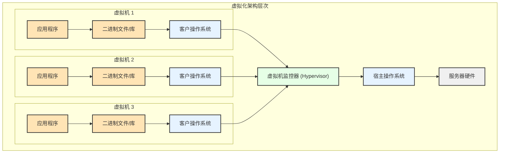
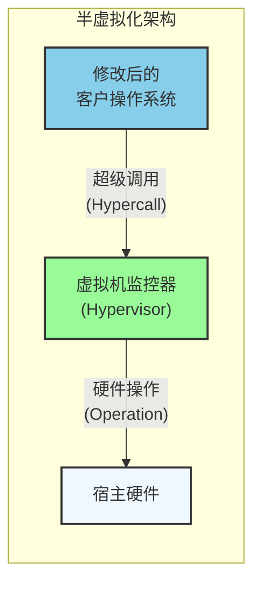

# 虚拟化技术深度解析：从 IBM 大机到现代云原生架构

> 原文来源：Novita AI Blog - "The Magic of Virtualization"  
> 发布时间：2024年6月26日  
> 译者注：本文面向有一定经验的工程师，深入探讨虚拟化技术的发展历程与核心实现

在现代 IT 基础设施中，虚拟化技术已经成为云计算、容器化部署和 DevOps 实践的基石。作为工程师，深入理解虚拟化的技术原理和发展脉络，对于架构设计和技术选型具有重要意义。

## 1. 技术起源与历史发展

虚拟化并非近年来的新概念。早在 1960 年代，IBM 的大型机系统（如 System/360）就引入了"分区"（Partitioning）概念。这项技术允许单台大机在不同分区中运行多个操作系统和应用程序，每个分区都拥有独立的资源池和运行环境。这种设计思想为现代虚拟化奠定了理论基础。

随着技术演进，虚拟化逐步从大机扩展到小型机和个人计算机领域。70-80 年代，UNIX 系统开始广泛应用虚拟化技术。Sun Microsystems 的 Solaris Zones 提供了操作系统级别的虚拟化，而 Linux 的 chroot 环境则实现了文件系统级别的隔离。这些早期技术为现代虚拟化架构的发展积累了宝贵经验。

## 2. 虚拟化架构分类与技术特性

### 2.1 全虚拟化（Full Virtualization）

全虚拟化通过引入虚拟机监控器（Virtual Machine Monitor，简称 Hypervisor）层来实现对物理硬件的抽象。这种架构下，客户操作系统（Guest OS）无需感知自己运行在虚拟环境中，Hypervisor 负责管理多个虚拟机的资源分配和隔离。

客户操作系统无需修改即可运行，这为企业提供了极大的灵活性。全虚拟化提供强隔离性和高安全性，能够支持异构操作系统混合部署，这在企业级环境中尤为重要。

KVM（Kernel-based Virtual Machine）作为 Linux 内核模块集成，提供接近硬件性能的虚拟化能力。它支持广泛的硬件平台和操作系统，在 OpenStack 等云平台中大量应用。VMware vSphere 则是企业级虚拟化的标杆产品，提供完整的虚拟化管理栈，支持大规模 VM 集群部署，具备先进的资源调度和故障恢复机制。Microsoft Hyper-V 深度集成 Windows Server 生态，支持动态内存分配和实时迁移，在混合云场景中表现出色。

### 2.2 半虚拟化（Paravirtualization）

半虚拟化要求客户操作系统感知虚拟化环境的存在，并通过特定 API 与虚拟化软件交互。虽然需要修改 OS 内核，但能够获得比全虚拟化更优的性能表现。这种方式通常与特定虚拟化平台深度绑定，但在性能要求极高的场景下具有明显优势。

Xen Hypervisor 最初专为半虚拟化设计，是重要的开源方案。它通过修改 Linux 内核实现高效虚拟化，在高性能计算和云服务提供商中广泛部署。值得注意的是，AWS EC2 早期就大量使用 Xen 技术，为其云计算平台的成功奠定了技术基础。

### 2.3 硬件辅助虚拟化（Hardware-Assisted Virtualization）

现代处理器通过扩展指令集为虚拟化提供硬件级支持，显著降低了虚拟化开销并提升了 VM 性能。这种技术充分利用 CPU 硬件特性提升虚拟化性能，简化 VMM 的复杂度，大幅降低虚拟化延迟。

Intel VT-x 技术是 Intel 的虚拟化技术扩展，通过硬件支持使 VM 性能接近原生系统，已成为现代 Intel 处理器的标配功能。AMD-V 技术提供类似功能，在高性能服务器市场占有重要地位。IBM PowerVM 专为 Power 系统设计，在大型企业和金融机构中应用广泛，提供极高的可靠性和性能保障。

```mermaid
graph TB
    subgraph FV["全虚拟化"]
        FV_R3["Ring 3<br/>用户应用"]
        FV_R2["Ring 2<br/>"]
        FV_R1["Ring 1<br/>客户操作系统"]
        FV_R0["Ring 0<br/>虚拟机监控器"]
        FV_HW["宿主计算机<br/>系统硬件"]
        
        FV_R3 --> FV_R2
        FV_R2 --> FV_R1
        FV_R1 --> FV_R0
        FV_R0 --> FV_HW
    end
    
    subgraph PV["半虚拟化"]
        PV_R3["Ring 3<br/>用户应用"]
        PV_R2["Ring 2<br/>"]
        PV_R1["Ring 1<br/>"]
        PV_R0["Ring 0<br/>半虚拟化<br/>客户操作系统"]
        PV_VL["虚拟化层"]
        PV_HW["宿主计算机<br/>系统硬件"]
        
        PV_R3 --> PV_R2
        PV_R2 --> PV_R1
        PV_R1 --> PV_R0
        PV_R0 --> PV_VL
        PV_VL --> PV_HW
    end
    
    subgraph HA["硬件辅助虚拟化"]
        HA_R3["Ring 3<br/>用户应用"]
        HA_R2["Ring 2<br/>"]
        HA_R1["Ring 1<br/>"]
        HA_R0_NR["Ring 0<br/>非根模式<br/>特权级别"]
        HA_R0_R["Ring 0<br/>根模式<br/>特权级别"]
        HA_R0_G["客户操作系统"]
        HA_R0_V["虚拟机监控器"]
        HA_HW["宿主计算机<br/>系统硬件"]
        
        HA_R3 --> HA_R2
        HA_R2 --> HA_R1
        HA_R1 --> HA_R0_G
        HA_R0_G --> HA_R0_V
        HA_R0_V --> HA_HW
    end
    
    classDef ring3Style fill:#FFA500,stroke:#333,stroke-width:2px
    classDef ring2Style fill:#D3D3D3,stroke:#333,stroke-width:2px
    classDef ring1Style fill:#4682B4,stroke:#333,stroke-width:2px
    classDef ring0Style fill:#1E90FF,stroke:#333,stroke-width:2px
    classDef hwStyle fill:#808080,stroke:#333,stroke-width:2px
    classDef vlStyle fill:#32CD32,stroke:#333,stroke-width:2px
    
    class FV_R3,PV_R3,HA_R3 ring3Style
    class FV_R2,PV_R2,HA_R2 ring2Style
    class FV_R1,HA_R1 ring1Style
    class FV_R0,PV_R0,HA_R0_G,HA_R0_V ring0Style
    class FV_HW,PV_HW,HA_HW hwStyle
    class PV_VL vlStyle
```

通过上述架构对比图可以清晰看出，三种虚拟化技术在 Ring 权限级别和实现方式上的差异。硬件辅助虚拟化通过引入根模式和非根模式的概念，实现了更高效的虚拟化性能。

## 3. 现代应用场景与技术实践

云计算基础设施领域，云服务提供商利用虚拟化技术构建弹性、可扩展的计算资源池。通过 VM 和容器技术，实现资源的按需分配和动态调度，这已成为现代云服务的核心能力。

在 DevOps 与 CI/CD 流水线中，虚拟化为开发团队提供了标准化的开发、测试和部署环境。Docker 容器和 Kubernetes 编排系统已成为现代软件交付的核心技术栈，极大提升了软件开发和部署的效率。

企业数据中心现代化过程中，传统企业通过虚拟化技术实现数据中心整合，提高硬件利用率，简化运维管理，降低总体拥有成本（TCO）。这种转型对于企业降本增效具有重要意义。

教育与研究环境中，高等院校和研究机构利用虚拟化技术为学生和研究人员提供多样化的实验环境，支持跨平台的学习和研究需求。

## 4. 技术发展趋势与未来展望

虚拟化技术的发展正朝着更轻量、更高效的方向演进。容器技术的兴起、Serverless 架构的普及，以及边缘计算的发展，都在推动虚拟化技术向新的高度发展。

对于工程师而言，理解虚拟化的核心原理不仅有助于做出更明智的技术选型，也是深入掌握云原生技术栈的重要基础。随着技术的持续演进，虚拟化将在未来的计算环境中发挥更加关键的作用。

---

*本文基于Novita AI原文翻译整理，结合国内技术实践进行本地化改编。原文链接：[The Magic of Virtualization](https://novita.ai/blog/the-magic-of-virtualization/)*

*更多技术深度内容，欢迎关注我们的技术博客。* 