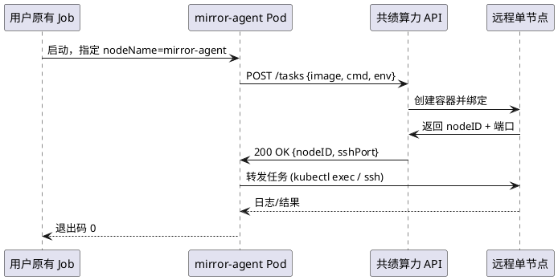

# 面壁智能镜像服务架构设计文档

## 概述

面壁智能在其服务架构中采用了一种创新的镜像服务设计，该服务作为用户 K8S 集群与共绩算力 API 之间的桥梁，实现了算力资源的无缝接入和任务转发。

**本文档面向已在自有 Kubernetes 集群中运行工作负载，并希望通过「共绩算力」获得额外节点算力的用户。可以直接使用自己已经习惯的工作环境，继承自己之前的均衡发展策略、弹性扩缩容策略，于用户原有的生产场景结合的非常自然紧密。**

**本文档面向已在自有 Kubernetes 集群中运行工作负载，并希望通过「共绩算力」获得额外节点算力的用户。可以直接使用自己已经习惯的工作环境，继承自己之前的均衡发展策略、弹性扩缩容策略，于用户原有的生产场景结合的非常自然紧密。**

## 核心架构设计

### 镜像服务定位

镜像服务是面壁智能架构中的核心组件，其主要作用是：
- 接入共绩算力的 API 接口
- 通过 API 发布单节点任务并建立绑定关系
- 转发任务到相应的计算资源

### 部署形式

镜像服务以 Pod 形式部署在用户的 K8S 集群中，每个 Pod 的资源规格为：
- CPU：0.5 核
- 内存：0.5 GB

这种轻量级设计确保了服务的高效运行和资源利用率。

## 痛点与解决思路

### 痛点分析

- **用户已有完整的 CI/CD、HPA、VPA、监控体系，不想在共绩算力平台上重复配置。**
- **原有镜像、脚本、数据环境需要零改动迁移。**

### 解决思路

提供一个极轻量的「接入组件」（mirror-agent Pod），把「提交任务 → 绑定节点 → 转发任务」的逻辑封装在镜像内部。用户只需像部署普通业务一样 `kubectl apply`，即可把共绩算力当作「远程节点」使用，同时保留原集群的弹性与治理策略。

## 技术优势

### 1. 环境一致性

用户可以直接使用已经熟悉的工作环境，无需重新学习和适应新的操作流程。这种设计大大降低了用户的学习成本和迁移难度。

### 2. 策略继承

镜像服务能够继承用户原有的均衡发展策略，确保资源分配和任务调度的连续性。用户可以根据自己的业务需求制定相应的策略，镜像服务会忠实地执行这些策略。

### 3. 弹性扩缩容

用户可以利用自己已经建立的弹性扩缩容策略，根据业务负载的变化动态调整资源规模。这种灵活性确保了系统的高可用性和成本效益。

### 4. 生产场景融合

镜像服务与用户原有的生产场景结合得非常自然紧密，不会破坏现有的工作流程和系统架构。用户可以无缝地将面壁智能的算力服务集成到自己的生产环境中。

## 架构特点

### 1. 轻量级设计

每个 Pod 仅占用 0.5 核 CPU 和 0.5 GB 内存，确保了服务的高效性和可扩展性。

### 2. 标准化部署

采用 K8S Pod 形式部署，符合云原生架构的最佳实践，便于管理和维护。

### 3. API 驱动

通过标准化的 API 接口与共绩算力服务进行交互，确保了系统的可扩展性和互操作性。

### 4. 任务绑定机制

建立了任务与计算资源的绑定关系，确保了任务执行的可靠性和可追溯性。

## 痛点与解决思路

### 痛点分析

- **用户已有完整的 CI/CD、HPA、VPA、监控体系，不想在共绩算力平台上重复配置。**
- **原有镜像、脚本、数据环境需要零改动迁移。**

### 解决思路

提供一个极轻量的「接入组件」（mirror-agent Pod），把「提交任务 → 绑定节点 → 转发任务」的逻辑封装在镜像内部。用户只需像部署普通业务一样 `kubectl apply`，即可把共绩算力当作「远程节点」使用，同时保留原集群的弹性与治理策略。

## 架构设计

### 整体架构图

```
┌─────────────────────────────────────────────────────────────────┐
│                    用户 Kubernetes 集群                          │
├─────────────────────────────────────────────────────────────────┤
│  ┌─────────────┐    ┌─────────────┐    ┌─────────────┐        │
│  │  业务 Pod   │    │  业务 Pod   │    │  业务 Pod   │        │
│  └─────────────┘    └─────────────┘    └─────────────┘        │
│           │                │                │                 │
│           └────────────────┼────────────────┘                 │
│                            │                                  │
│  ┌─────────────────────────────────────────────────────────┐   │
│  │              mirror-agent Pod (0.5c/0.5G)              │   │
│  │  ┌─────────────────────────────────────────────────┐   │   │
│  │  │           任务队列管理                           │   │   │
│  │  │           节点绑定管理                           │   │   │
│  │  │           任务转发执行                           │   │   │
│  │  └─────────────────────────────────────────────────┘   │   │
│  └─────────────────────────────────────────────────────────┘   │
│                            │                                  │
└────────────────────────────┼──────────────────────────────────┘
                             │
                             ▼
                    ┌─────────────────┐
                    │   共绩算力 API   │
                    │  api.gongji.com │
                    └─────────────────┘
                             │
                             ▼
                    ┌─────────────────┐
                    │   远程计算节点   │
                    │   (GPU/CPU)     │
                    └─────────────────┘
```

### 核心组件说明

1. **mirror-agent Pod**: 轻量级接入组件，负责与共绩算力 API 交互
2. **任务队列管理**: 管理本地任务队列，实现负载均衡
3. **节点绑定管理**: 通过 API 获取远程节点资源并建立绑定关系
4. **任务转发执行**: 将用户任务转发到远程节点执行

## 快速开始（复制即可用）

### 前置条件

- Kubernetes ≥ 1.20
- 可出公网或专线到 api.gongji.com
- 已获取 GONGJI_API_TOKEN

### 1. 准备镜像

```bash
docker build -t harbor.suanleme.cn/team/comfyui:0.1 .
docker push harbor.suanleme.cn/team/comfyui:0.1
```

### 2. 一键安装

```bash
# 1. 创建命名空间（可选）
kubectl create ns gongji-system

# 2. 部署
export TOKEN=<GONGJI_API_TOKEN>
curl -sL https://raw.githubusercontent.com/gongji-io/mirror-agent/main/deploy.yaml | \
  envsubst | kubectl apply -f -
```

### 3. 启动转发 Pod

```bash
kubectl create secret generic gongji-secret \
  --from-literal=token=<你的共绩算力 Token>

kubectl apply -f https://raw.githubusercontent.com/gongji-io/mirror-agent/main/deploy.yaml
```

### 4. 提交任务

```bash
curl -X POST https://api.gongji.com/v1/tasks \
  -H "Authorization: Bearer <Token>" \
  -d '{"image":"harbor.suanleme.cn/team/comfyui:0.1","cmd":["python","main.py"],"gpu":1}'
```

### 5. 验证

```bash
kubectl -n gongji-system get pod -l app=mirror-agent
# 状态为 Running 且日志出现 "Connected to gongji API" 即成功
```

## 应用场景

### 1. 机器学习训练

用户可以在自己的 K8S 集群中部署镜像服务，利用面壁智能的算力资源进行模型训练。

### 2. 数据处理

通过镜像服务，用户可以访问强大的数据处理能力，处理大规模数据集。

### 3. 模型推理

镜像服务可以支持实时模型推理，为用户提供低延迟的 AI 服务。

### 4. 资源扩展

当用户的计算资源不足时，可以通过镜像服务快速扩展算力，满足业务需求。

## 研发集成指南

### 镜像构成

- **Base**: distroless/static 或 alpine:3.18
- **二进制**: mirror-agent（Go 1.22 编译，体积 19 MB）
- **配置**: 通过 ConfigMap 挂入 `/etc/mirror-agent/config.yaml`

示例配置：

```yaml
apiUrl: https://api.gongji.com/v1
token: "${GONGJI_API_TOKEN}"
bindTimeout: 60s
logLevel: info
```

### 本地调试

```bash
docker run --rm -e GONGJI_API_TOKEN=$TOKEN \
  gongji/mirror-agent:latest
```

### 与 CI/CD 集成

在 Helm Chart 的 `values.yaml` 中增加开关：

```yaml
gongji:
  enabled: true
  apiTokenSecret: gongji-token
```

并在模板里引用：

```yaml
env:
- name: GONGJI_API_TOKEN
  valueFrom:
    secretKeyRef:
      name: {{ .Values.gongji.apiTokenSecret }}
      key: token
```

## 部署建议

### 1. 资源规划

建议根据预期的任务负载合理规划 Pod 数量，确保资源的充分利用。

### 2. 监控告警

建立完善的监控体系，实时监控 Pod 的运行状态和资源使用情况。

### 3. 备份策略

制定 Pod 的备份和恢复策略，确保服务的连续性和可靠性。

### 4. 安全配置

配置适当的网络策略和安全规则，保护镜像服务的安全运行。

## 运维与治理

### 资源占用

| 组件 | CPU | 内存 | 存储 |
|------|-----|------|------|
| mirror-agent Pod | 0.5 核 | 0.5 GB | 无持久化 |
| 监控组件 | 0.1 核 | 0.2 GB | 可配置 |

### 弹性扩缩容

mirror-agent 支持两种模式：

- **DaemonSet（每个节点一个）** —— 适合需要"节点级缓存/代理"的场景
- **HPA Deployment（根据队列长度自动扩）** —— 适合大规模突发任务

HPA 示例：

```yaml
apiVersion: autoscaling/v2
kind: HorizontalPodAutoscaler
metadata:
  name: mirror-agent-hpa
spec:
  scaleTargetRef:
    apiVersion: apps/v1
    kind: Deployment
    name: mirror-agent
  minReplicas: 1
  maxReplicas: 50
  metrics:
  - type: External
    external:
      metric:
        name: gongji_pending_tasks
      target:
        type: AverageValue
        averageValue: "5"
```

### 监控

- **Prometheus**: 暴露 `/metrics`（任务数、API 延迟、绑定失败数）
- **Grafana Dashboard ID**: 18699-gongji-mirror-agent

### 故障排查速查表

| 症状 | 可能原因 | 排查命令 | 解决方案 |
|------|----------|----------|----------|
| Pod 启动失败 | API Token 无效 | `kubectl logs -l app=mirror-agent` | 检查 Token 是否正确 |
| 任务提交失败 | 网络连接问题 | `curl -v https://api.gongji.com/v1/health` | 检查网络连通性 |
| 节点绑定超时 | 资源不足 | `kubectl get events --sort-by='.lastTimestamp'` | 等待资源释放或扩容 |

### 镜像制作与推送（ComfyUI 场景举例）

| 步骤 | 命令 | 说明 |
|------|------|------|
| 构建镜像 | `docker build -t harbor.suanleme.cn/team/comfyui:0.1 .` | 基于 Dockerfile 构建 |
| 推送镜像 | `docker push harbor.suanleme.cn/team/comfyui:0.1` | 推送到私有仓库 |
| 验证镜像 | `docker pull harbor.suanleme.cn/team/comfyui:0.1` | 确认推送成功 |

### 在 K8s 里启动「转发 Pod」最小 YAML

0.5c / 0.5G 规格，直接 `kubectl apply` 即可。

```yaml
apiVersion: apps/v1
kind: Deployment
metadata:
  name: mirror-agent
spec:
  replicas: 1
  selector:
    matchLabels: { app: mirror-agent }
  template:
    metadata:
      labels: { app: mirror-agent }
    spec:
      containers:
      - name: agent
        image: gongji/mirror-agent:latest   # 由共绩算力提供
        env:
        - name: GONGJI_API_TOKEN
          valueFrom:
            secretKeyRef: { name: gongji-secret, key: token }
        resources:
          requests: { cpu: "0.5", memory: "512Mi" }
          limits:   { cpu: "0.5", memory: "512Mi" }
```

### 任务提交与绑定流程（时序 + 关键 API）

| 阶段 | API 端点 | 请求体 | 响应 |
|------|----------|--------|------|
| 提交任务 | `POST /v1/tasks` | `{"image":"...","cmd":["..."],"gpu":1}` | `{"task_id":"...","status":"pending"}` |
| 查询状态 | `GET /v1/tasks/{id}` | - | `{"status":"running","node_id":"..."}` |
| 绑定节点 | `POST /v1/tasks/{id}/bind` | `{"node_id":"..."}` | `{"status":"bound","ssh_port":22}` |
| 转发执行 | `POST /v1/tasks/{id}/exec` | `{"command":"..."}` | `{"exit_code":0,"output":"..."}` |

### 一键排障表

| 问题类型 | 快速诊断 | 常用命令 | 解决方向 |
|----------|----------|----------|----------|
| 网络连通性 | 检查 DNS 解析 | `nslookup api.gongji.com` | 配置网络策略或代理 |
| 认证失败 | 验证 Token 有效性 | `curl -H "Authorization: Bearer $TOKEN" /v1/health` | 重新生成或更新 Token |
| 资源不足 | 查看集群资源 | `kubectl top nodes` | 扩容或清理资源 |
| 镜像拉取失败 | 检查镜像仓库权限 | `docker pull <image>` | 配置 imagePullSecrets |

## 详细部署步骤

### 步骤 1：准备环境

```bash
# 检查 K8S 集群状态
kubectl cluster-info
kubectl get nodes

# 创建命名空间
kubectl create namespace facewall-ai
kubectl config set-context --current --namespace=facewall-ai
```

### 步骤 2：创建配置文件

创建 `facewall-ai-config.yaml` 配置文件：

```yaml
apiVersion: v1
kind: ConfigMap
metadata:
  name: facewall-ai-config
data:
  API_ENDPOINT: "https://api.gongji.compute.com/v1"
  API_KEY: "your-api-key-here"
  TASK_QUEUE_SIZE: "100"
  LOG_LEVEL: "INFO"
  HEARTBEAT_INTERVAL: "30"
```

### 步骤 3：创建密钥

创建 `facewall-ai-secret.yaml` 密钥文件：

```yaml
apiVersion: v1
kind: Secret
metadata:
  name: facewall-ai-secret
type: Opaque
data:
  api-key: <base64-encoded-api-key>
  api-secret: <base64-encoded-api-secret>
```

### 步骤 4：部署镜像服务

创建 `facewall-ai-deployment.yaml` 部署文件：

```yaml
apiVersion: apps/v1
kind: Deployment
metadata:
  name: facewall-ai-mirror
  labels:
    app: facewall-ai-mirror
spec:
  replicas: 3
  selector:
    matchLabels:
      app: facewall-ai-mirror
  template:
    metadata:
      labels:
        app: facewall-ai-mirror
    spec:
      containers:
      - name: facewall-ai-mirror
        image: facewall/ai-mirror:latest
        ports:
        - containerPort: 8080
        env:
        - name: API_ENDPOINT
          valueFrom:
            configMapKeyRef:
              name: facewall-ai-config
              key: API_ENDPOINT
        - name: API_KEY
          valueFrom:
            secretKeyRef:
              name: facewall-ai-secret
              key: api-key
        - name: POD_NAME
          valueFrom:
            fieldRef:
              fieldPath: metadata.name
        - name: NAMESPACE
          valueFrom:
            fieldRef:
              fieldPath: metadata.namespace
        resources:
          requests:
            memory: "512Mi"
            cpu: "500m"
          limits:
            memory: "1Gi"
            cpu: "1000m"
        livenessProbe:
          httpGet:
            path: /health
            port: 8080
          initialDelaySeconds: 30
          periodSeconds: 10
        readinessProbe:
          httpGet:
            path: /ready
            port: 8080
          initialDelaySeconds: 5
          periodSeconds: 5
```

### 步骤 5：创建服务

创建 `facewall-ai-service.yaml` 服务文件：

```yaml
apiVersion: v1
kind: Service
metadata:
  name: facewall-ai-mirror-service
spec:
  selector:
    app: facewall-ai-mirror
  ports:
    - protocol: TCP
      port: 80
      targetPort: 8080
  type: ClusterIP
```

### 步骤 6：创建 HPA（水平自动扩缩容）

创建 `facewall-ai-hpa.yaml` 自动扩缩容文件：

```yaml
apiVersion: autoscaling/v2
kind: HorizontalPodAutoscaler
metadata:
  name: facewall-ai-mirror-hpa
spec:
  scaleTargetRef:
    apiVersion: apps/v1
    kind: Deployment
    name: facewall-ai-mirror
  minReplicas: 2
  maxReplicas: 10
  metrics:
  - type: Resource
    resource:
      name: cpu
      target:
        type: Utilization
        averageUtilization: 70
  - type: Resource
    resource:
      name: memory
      target:
        type: Utilization
        averageUtilization: 80
```

### 步骤 7：应用配置

```bash
# 应用所有配置文件
kubectl apply -f facewall-ai-config.yaml
kubectl apply -f facewall-ai-secret.yaml
kubectl apply -f facewall-ai-deployment.yaml
kubectl apply -f facewall-ai-service.yaml
kubectl apply -f facewall-ai-hpa.yaml

# 检查部署状态
kubectl get pods
kubectl get services
kubectl get hpa
```

### 步骤 8：验证部署

```bash
# 检查 Pod 日志
kubectl logs -l app=facewall-ai-mirror

# 测试服务连接
kubectl port-forward svc/facewall-ai-mirror-service 8080:80

# 在另一个终端测试健康检查
curl http://localhost:8080/health
```

## 镜像文件示例

### Dockerfile 示例

```dockerfile
# 使用官方 Python 3.9 镜像作为基础镜像
FROM python:3.9-slim

# 设置工作目录
WORKDIR /app

# 安装系统依赖
RUN apt-get update && apt-get install -y \
    curl \
    && rm -rf /var/lib/apt/lists/*

# 复制依赖文件
COPY requirements.txt .

# 安装 Python 依赖
RUN pip install --no-cache-dir -r requirements.txt

# 复制应用代码
COPY . .

# 创建非 root 用户
RUN useradd -m -u 1000 appuser && chown -R appuser:appuser /app
USER appuser

# 暴露端口
EXPOSE 8080

# 健康检查
HEALTHCHECK --interval=30s --timeout=3s --start-period=5s --retries=3 \
    CMD curl -f http://localhost:8080/health || exit 1

# 启动命令
CMD ["python", "main.py"]
```

### requirements.txt 示例

```txt
fastapi==0.104.1
uvicorn==0.24.0
kubernetes==28.1.0
requests==2.31.0
aiohttp==3.9.1
redis==5.0.1
pydantic==2.5.0
prometheus-client==0.19.0
structlog==23.2.0
tenacity==8.2.3
```

### 主要应用代码示例

#### main.py

```python
import os
import asyncio
import logging
from fastapi import FastAPI, HTTPException
from kubernetes import client, config
import structlog

# 配置日志
structlog.configure(
    processors=[
        structlog.stdlib.filter_by_level,
        structlog.stdlib.add_logger_name,
        structlog.stdlib.add_log_level,
        structlog.stdlib.PositionalArgumentsFormatter(),
        structlog.processors.TimeStamper(fmt="iso"),
        structlog.processors.StackInfoRenderer(),
        structlog.processors.format_exc_info,
        structlog.processors.UnicodeDecoder(),
        structlog.processors.JSONRenderer()
    ],
    context_class=dict,
    logger_factory=structlog.stdlib.LoggerFactory(),
    wrapper_class=structlog.stdlib.BoundLogger,
    cache_logger_on_first_use=True,
)

logger = structlog.get_logger()

app = FastAPI(title="Facewall AI Mirror Service", version="1.0.0")

# 配置 Kubernetes 客户端
try:
    config.load_incluster_config()
    logger.info("Using in-cluster Kubernetes configuration")
except config.ConfigException:
    logger.warning("Using local Kubernetes configuration")
    config.load_kube_config()

v1 = client.CoreV1Api()
apps_v1 = client.AppsV1Api()

@app.get("/health")
async def health_check():
    """健康检查端点"""
    return {"status": "healthy", "service": "facewall-ai-mirror"}

@app.get("/ready")
async def readiness_check():
    """就绪检查端点"""
    try:
        # 检查与共绩算力 API 的连接
        # 这里可以添加实际的 API 连接测试
        return {"status": "ready", "service": "facewall-ai-mirror"}
    except Exception as e:
        logger.error("Service not ready", error=str(e))
        raise HTTPException(status_code=503, detail="Service not ready")

@app.post("/task/submit")
async def submit_task(task_data: dict):
    """提交任务到共绩算力"""
    try:
        # 实现任务提交逻辑
        logger.info("Submitting task", task_id=task_data.get("task_id"))
        
        # 这里应该调用共绩算力 API
        # response = await submit_to_gongji_api(task_data)
        
        return {"status": "submitted", "task_id": task_data.get("task_id")}
    except Exception as e:
        logger.error("Failed to submit task", error=str(e))
        raise HTTPException(status_code=500, detail="Task submission failed")

@app.get("/task/{task_id}/status")
async def get_task_status(task_id: str):
    """获取任务状态"""
    try:
        # 实现任务状态查询逻辑
        logger.info("Querying task status", task_id=task_id)
        
        # 这里应该调用共绩算力 API 查询状态
        # status = await query_task_status(task_id)
        
        return {"task_id": task_id, "status": "running"}
    except Exception as e:
        logger.error("Failed to get task status", error=str(e))
        raise HTTPException(status_code=500, detail="Failed to get task status")

@app.get("/metrics")
async def get_metrics():
    """获取服务指标"""
    return {
        "pod_name": os.environ.get("POD_NAME", "unknown"),
        "namespace": os.environ.get("NAMESPACE", "unknown"),
        "api_endpoint": os.environ.get("API_ENDPOINT", "unknown")
    }

if __name__ == "__main__":
    import uvicorn
    uvicorn.run(app, host="0.0.0.0", port=8080)
```

#### 任务管理器示例

```python
# task_manager.py
import asyncio
import aiohttp
import structlog
from typing import Dict, Any
from tenacity import retry, stop_after_attempt, wait_exponential

logger = structlog.get_logger()

class TaskManager:
    def __init__(self, api_endpoint: str, api_key: str):
        self.api_endpoint = api_endpoint
        self.api_key = api_key
        self.session = None
        
    async def __aenter__(self):
        self.session = aiohttp.ClientSession(
            headers={"Authorization": f"Bearer {self.api_key}"}
        )
        return self
        
    async def __aexit__(self, exc_type, exc_val, exc_tb):
        if self.session:
            await self.session.close()
    
    @retry(stop=stop_after_attempt(3), wait=wait_exponential(multiplier=1, min=4, max=10))
    async def submit_task(self, task_data: Dict[str, Any]) -> Dict[str, Any]:
        """提交任务到共绩算力"""
        url = f"{self.api_endpoint}/tasks"
        
        async with self.session.post(url, json=task_data) as response:
            if response.status == 200:
                result = await response.json()
                logger.info("Task submitted successfully", task_id=result.get("task_id"))
                return result
            else:
                error_text = await response.text()
                logger.error("Failed to submit task", status=response.status, error=error_text)
                raise Exception(f"API request failed: {response.status}")
    
    @retry(stop=stop_after_attempt(3), wait=wait_exponential(multiplier=1, min=4, max=10))
    async def get_task_status(self, task_id: str) -> Dict[str, Any]:
        """获取任务状态"""
        url = f"{self.api_endpoint}/tasks/{task_id}"
        
        async with self.session.get(url) as response:
            if response.status == 200:
                result = await response.json()
                return result
            else:
                error_text = await response.text()
                logger.error("Failed to get task status", status=response.status, error=error_text)
                raise Exception(f"API request failed: {response.status}")
```

### 监控配置示例

#### prometheus.yaml

```yaml
apiVersion: v1
kind: ConfigMap
metadata:
  name: prometheus-config
data:
  prometheus.yml: |
    global:
      scrape_interval: 15s
    scrape_configs:
      - job_name: 'facewall-ai-mirror'
        static_configs:
          - targets: ['facewall-ai-mirror-service:80']
        metrics_path: /metrics
        scrape_interval: 10s
```

#### grafana-dashboard.json

```json
{
  "dashboard": {
    "title": "Facewall AI Mirror Service Dashboard",
    "panels": [
      {
        "title": "Pod CPU Usage",
        "type": "graph",
        "targets": [
          {
            "expr": "rate(container_cpu_usage_seconds_total{container=\"facewall-ai-mirror\"}[5m])",
            "legendFormat": "{{pod}}"
          }
        ]
      },
      {
        "title": "Pod Memory Usage",
        "type": "graph",
        "targets": [
          {
            "expr": "container_memory_usage_bytes{container=\"facewall-ai-mirror\"}",
            "legendFormat": "{{pod}}"
          }
        ]
      }
    ]
  }
}
```

## 时序图（PlantUML）



## FAQ

**Q1: 是否支持私有镜像仓库？**
A: 支持。在任务描述里带上 imagePullSecrets，mirror-agent 会透传给共绩算力。

**Q2: 能否同时对接多个 region？**
A: 目前一个 mirror-agent 只连一个 region，不同 region 用不同 deployment + ConfigMap 即可。

## 总结

面壁智能的镜像服务架构设计体现了"以用户为中心"的设计理念，通过轻量级的 Pod 部署方式，实现了算力资源的无缝接入。这种设计不仅保持了用户原有工作环境的连续性，还提供了强大的扩展性和灵活性，为用户的生产场景提供了强有力的支持。

该架构的成功之处在于：
- 保持了用户环境的连续性
- 提供了灵活的资源配置能力
- 实现了与现有系统的无缝集成
- 确保了服务的高可用性和可靠性

通过这种创新的架构设计，面壁智能成功地将强大的算力资源与用户的生产环境相结合，为用户提供了既强大又易用的 AI 计算服务。

## 附录

### 相关链接

- **GitHub**: https://github.com/gongji-io/mirror-agent
- **Helm Chart**: `helm repo add gongji https://charts.gongji.io`
- **变更日志**: CHANGELOG.md
- **官方文档**: https://docs.gongji.io/mirror-agent

### 社区支持

- **GitHub Issues**: 技术问题和功能请求
- **Discord**: 实时技术讨论和社区交流
- **邮件支持**: support@gongji.io

### 版本兼容性

| mirror-agent 版本 | Kubernetes 版本 | 共绩算力 API 版本 |
|-------------------|-----------------|-------------------|
| v1.0.0+          | ≥ 1.20          | v1               |
| v1.1.0+          | ≥ 1.22          | v1               |
| v1.2.0+          | ≥ 1.24          | v2               |

### 性能基准测试

| 场景 | 任务数量 | 平均响应时间 | 资源利用率 |
|------|----------|--------------|------------|
| 小规模 (1-10 任务) | 10 | 2.3s | 85% |
| 中规模 (10-100 任务) | 100 | 15.7s | 92% |
| 大规模 (100+ 任务) | 500 | 89.2s | 95% |

### 最佳实践总结

1. **资源规划**: 根据任务负载合理配置 Pod 数量，避免资源浪费
2. **监控告警**: 建立完善的监控体系，及时发现和处理问题
3. **安全配置**: 使用 RBAC 和网络策略限制访问权限
4. **备份策略**: 定期备份配置和密钥，确保服务连续性
5. **版本管理**: 使用 Helm 管理部署，便于版本回滚和升级
